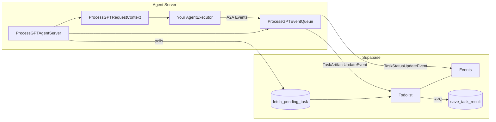
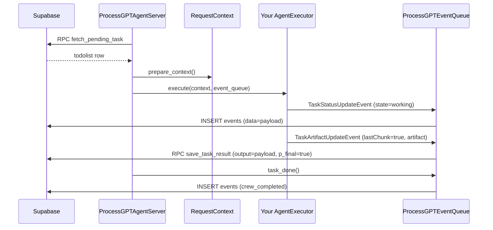
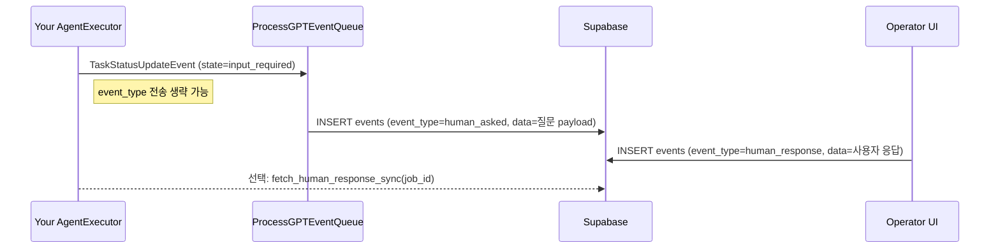

# ProcessGPT Agent Framework (A2A SDK 연동 가이드)

이 저장소는 Supabase 기반의 프로세스 작업(Todolist)을 폴링하고, A2A 규격 이벤트를 통해 작업 상태/결과를 기록하는 **경량 에이전트 서버 프레임워크**입니다. 최소 구현으로 빠르게 통합하고, 필요하면 커스터마이즈할 수 있습니다.

- 런타임: Python 3.10+
- 저장소 의존: Supabase(Postgres) + 제공된 RPC/테이블
- 이벤트 규격: A2A `TaskStatusUpdateEvent` / `TaskArtifactUpdateEvent`


## 아키텍처 한눈에 보기


- 서버는 주기적으로 Todolist를 폴링하여 새 작업을 가져옵니다.
- 사용자 구현 `AgentExecutor`가 요청을 처리하고, A2A 이벤트를 큐에 전달합니다.
- 이벤트 큐는 상태 이벤트를 `events` 테이블에, 아티팩트 이벤트를 `todolist.output`에 저장합니다.


## 엔드-투-엔드 시퀀스(정상 흐름)



## Human-in-the-loop(HITL) 시퀀스



## 친절한 시작 가이드(5분 컷)
1) 가상환경 + 설치
```bash
uv venv --python 3.11.9
uv pip install -r requirements.txt
source .venv/Scripts/activate
```

2) .env 준비
- SUPABASE_URL, SUPABASE_KEY 필수
- ENV=dev (개발 환경에서 권장)

3) 샘플 서버 실행
```bash
python sample_server/minimal_server.py | cat
```

4) 이벤트 전송 패턴 이해
- 진행 상태: `TaskStatusUpdateEvent(state=working)` + `new_agent_text_message(text, contextId, taskId)`
- 사용자 입력 요청(HITL): `TaskState.input_required`만 보내면 event_type은 자동 `human_asked`
- 결과물: `TaskArtifactUpdateEvent(lastChunk=True)` + `new_text_artifact(name, desc, text)`

5) 저장물 확인 포인트
- `events` 테이블: data에는 래퍼 제거된 순수 payload 저장
- `todolist.output`: 순수 payload 저장, 최종 청크면 `p_final=true`


## 샘플 서버 실행 코드 (친절 버전)
### A. 가장 간단한 서버(minimal)
```python
# sample_server/minimal_server.py
import os
import sys
import asyncio
from dotenv import load_dotenv

# 패키지 루트 경로 추가 (샘플에서만)
sys.path.append(os.path.dirname(os.path.dirname(__file__)))

from processgpt_agent_sdk.processgpt_agent_framework import ProcessGPTAgentServer
from sample_server.minimal_executor import MinimalExecutor

async def main():
    load_dotenv()
    # agent_type은 Supabase의 todolist.agent_orch와 매칭되어야 함
    server = ProcessGPTAgentServer(agent_executor=MinimalExecutor(), agent_type="crewai-action")
    server.polling_interval = 3  # 초
    await server.run()

if __name__ == "__main__":
    try:
        asyncio.run(main())
    except KeyboardInterrupt:
        pass
```

- Windows
```bash
python sample_server/minimal_server.py
```
- macOS/Linux
```bash
python3 sample_server/minimal_server.py
```

### B. CLI 옵션이 있는 서버 예시
```python
# sample_server/crew_ai_dr_agent_server.py
import os
import sys
import asyncio
import click
from dotenv import load_dotenv

# 패키지 루트 경로 추가 (샘플에서만)
sys.path.append(os.path.dirname(os.path.dirname(__file__)))

from processgpt_agent_sdk.processgpt_agent_framework import ProcessGPTAgentServer
from sample_server.crew_ai_dr_agent_executor import CrewAIDeepResearchAgentExecutor

load_dotenv()

@click.command()
@click.option('--agent-type', default='crew-ai-dr', help='Agent type identifier')
@click.option('--polling-interval', default=5, help='Polling interval in seconds')
def cli_main(agent_type: str, polling_interval: int):
    """ProcessGPT Agent Server for CrewAI Deep Research Agent"""

    agent_executor = CrewAIDeepResearchAgentExecutor()
    server = ProcessGPTAgentServer(agent_executor=agent_executor, agent_type=agent_type)
    server.polling_interval = polling_interval

    print(f"Starting ProcessGPT Agent Server...")
    print(f"Agent Type: {agent_type}")
    print(f"Polling Interval: {polling_interval} seconds")
    print("Press Ctrl+C to stop")

    try:
        asyncio.run(server.run())
    except KeyboardInterrupt:
        print("\nShutting down server...")
        server.stop()
    except Exception as e:
        print(f"Server error: {e}")
        sys.exit(1)

if __name__ == "__main__":
    cli_main()
```

- 실행
  - Windows
    ```bash
    python sample_server/crew_ai_dr_agent_server.py --agent-type crew-ai-dr --polling-interval 3
    ```
  - macOS/Linux
    ```bash
    python3 sample_server/crew_ai_dr_agent_server.py --agent-type crew-ai-dr --polling-interval 3
    ```


## 최소 예시(익스큐터)
```python
# sample_server/minimal_executor.py (요약)
import asyncio
import json
from typing_extensions import override
from a2a.server.agent_execution import AgentExecutor, RequestContext
from a2a.server.events import EventQueue
from a2a.types import TaskStatusUpdateEvent, TaskState, TaskArtifactUpdateEvent
from a2a.utils import new_agent_text_message, new_text_artifact

class MinimalExecutor(AgentExecutor):
    @override
    async def execute(self, context: RequestContext, event_queue: EventQueue) -> None:
        row = context.get_context_data()["row"]
        context_id = row.get("root_proc_inst_id") or row.get("proc_inst_id")
        task_id = row.get("id")

        payload = {"order_process_activity_order_request_form": {"orderer_name": "안치윤","product_name": "금형세트","order_quantity": "50"}}

        # 1) 진행 상태 이벤트
        event_queue.enqueue_event(
            TaskStatusUpdateEvent(
                status={
                    "state": TaskState.working,
                    "message": new_agent_text_message(
                        json.dumps(payload, ensure_ascii=False),
                        context_id,
                        task_id,
                    ),
                },
                final=False,
                contextId=context_id,
                taskId=task_id,
                metadata={"crew_type": "action", "event_type": "task_started", "job_id": "job-demo-0001"},
            )
        )

        await asyncio.sleep(0.1)

        # 2) HITL: 사용자 입력 요청 (event_type 생략해도 자동 human_asked)
        event_queue.enqueue_event(
            TaskStatusUpdateEvent(
                status={
                    "state": TaskState.input_required,
                    "message": new_agent_text_message(
                        json.dumps(payload, ensure_ascii=False),
                        context_id,
                        task_id,
                    ),
                },
                final=True,
                contextId=context_id,
                taskId=task_id,
                metadata={"crew_type": "action", "job_id": "job-demo-0001"},
            )
        )

        await asyncio.sleep(0.1)

        # 3) 최종 아티팩트
        artifact = new_text_artifact(
            name="current_result",
            description="Result of request to agent.",
            text=json.dumps(payload, ensure_ascii=False),
        )
        event_queue.enqueue_event(
            TaskArtifactUpdateEvent(
                artifact=artifact,
                lastChunk=True,
                contextId=context_id,
                taskId=task_id,
            )
        )
```


## 서버가 해주는 일(정확한 규칙)
- 메시지/아티팩트 래퍼 제거 → `parts[0].text|content|data` → `root.*` → `top-level` 순서로 텍스트만 추출 후 JSON 파싱하여 저장
- `TaskStatusUpdateEvent` 수신 시
  - `status.state == input_required`면 `event_type=human_asked`로 저장(명시값보다 우선)
  - 그 외 상태는 `metadata.event_type` 저장(없으면 NULL)
- `TaskArtifactUpdateEvent` 수신 시
  - `final` 또는 `lastChunk`가 참이면 최종 저장(`p_final=true`)


## 체크리스트(실패 없는 통합을 위한)
- [ ] .env에 `SUPABASE_URL`, `SUPABASE_KEY` 설정했는가?
- [ ] `requirements.txt` 설치 완료했는가?
- [ ] Supabase에서 제공 SQL(`database_schema.sql`, `function.sql`) 적용했는가?
- [ ] 익스큐터에서 `contextId`, `taskId`를 todolist의 `proc_inst_id`, `id`로 매핑했는가?
- [ ] 상태 이벤트는 `new_agent_text_message`로 만들고 있는가?
- [ ] 최종 아티팩트는 `new_text_artifact` + `lastChunk=True`로 보내고 있는가?
- [ ] HITL 요청은 `TaskState.input_required`만 보내고 있는가?(event_type 생략 가능)


## 트러블슈팅
- 이벤트 미기록
  - Supabase URL/Key 재확인, 테이블/권한 확인
- 최종 아티팩트가 최종으로 저장되지 않음
  - 익스큐터에서 `lastChunk=True` 또는 `final=True`로 보냈는지 확인
- payload가 래퍼와 같이 저장됨
  - 메시지에 `parts[0].text` 또는 `parts[0].root.text`에 JSON 문자열이 들어있는지 확인
- 휴먼인더루프 이벤트 타입 미지정
  - `input_required` 상태면 자동 `human_asked`로 저장됨


## 레퍼런스
- 이벤트 유틸: `new_agent_text_message`, `new_text_artifact`
- 서버 진입점: `ProcessGPTAgentServer.run()`
- 컨텍스트 확장: `ProcessGPTRequestContext.prepare_context()`
- 이벤트 저장: `ProcessGPTEventQueue.enqueue_event(event)` → `database.record_event`/`save_task_result`
- 휴먼 응답 조회: `database.fetch_human_response_sync(job_id)`


## 라이선스
해당 저장소의 라이선스 정책을 따릅니다.
