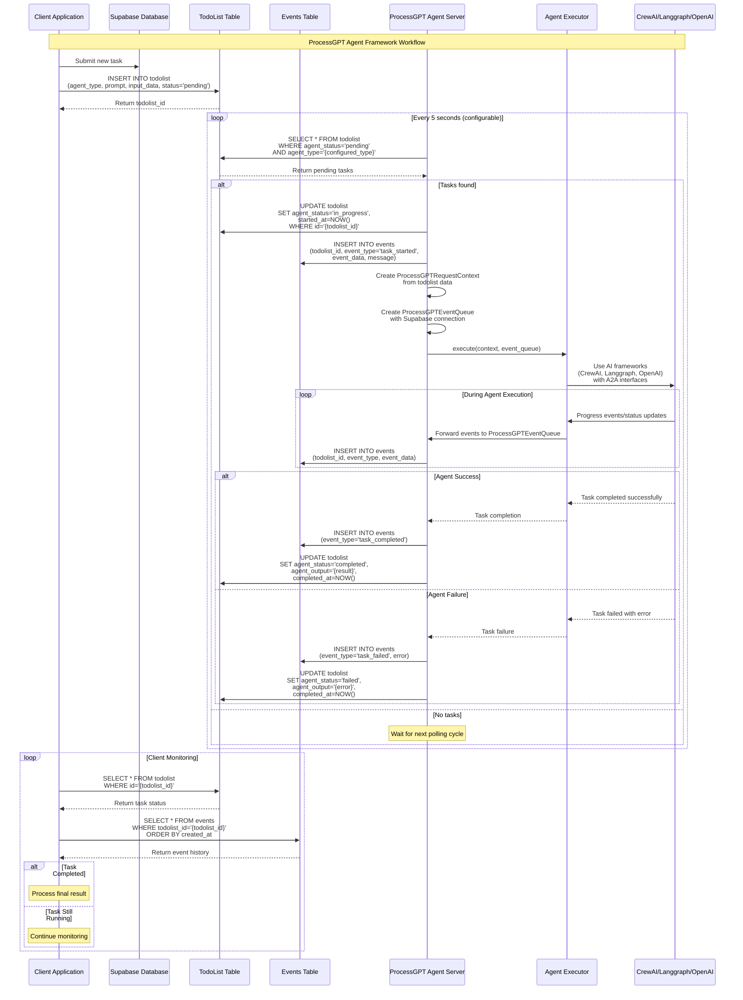

# ProcessGPT Agent Framework

Google A2A SDK의 인터페이스를 활용하면서 웹소켓 대신 Supabase 실시간 DB를 사용하는 에이전트 실행 프레임워크입니다.

## 🏗️ 아키텍처 개요

이 프레임워크는 기존의 Google A2A SDK의 `AgentExecutor`와 `RequestContext` 인터페이스를 그대로 활용하되, 웹소켓 기반 통신 대신 Supabase 데이터베이스를 중간 매개체로 사용합니다.

### 핵심 구성 요소

1. **Supabase Database Tables**
   - `todolist`: 에이전트가 처리해야 할 작업들을 저장
   - `events`: 각 태스크의 실행 상태와 진행 과정을 추적

2. **ProcessGPT Server**
   - Supabase `todolist` 테이블을 폴링하여 대기 중인 작업을 감지
   - Google A2A SDK의 `AgentExecutor.execute()` 메서드를 호출
   - 커스터마이즈된 `EventQueue`를 통해 이벤트를 Supabase에 저장

3. **Custom Classes**
   - `ProcessGPTRequestContext`: todolist 데이터를 기반으로 한 RequestContext 구현
   - `ProcessGPTEventQueue`: Supabase events 테이블에 이벤트를 저장하는 EventQueue 구현

## 🎮 ProcessGPT Agent Simulator

**데이터베이스 연결 없이** ProcessGPT 에이전트를 시뮬레이션할 수 있는 완전한 툴킷이 제공됩니다. 개발, 테스트, 데모 목적으로 사용할 수 있습니다.

### 🚀 빠른 시작

#### 독립적인 시뮬레이터 (추천)

```bash
# 기본 시뮬레이션 실행
python3 simulate_standalone.py "데이터를 분석해주세요"

# 빠른 실행 (지연 시간 단축)
python3 simulate_standalone.py "보고서를 작성해주세요" --delay 0.3

# 상세 로그와 함께
python3 simulate_standalone.py "고객 문의를 처리해주세요" --verbose

# 도움말 보기
python3 simulate_standalone.py --help
```

#### 의존성이 있는 시뮬레이터

```bash
# 간단한 시뮬레이션 실행
python processgpt_simulator_cli.py "데이터를 분석해주세요"

# 또는 shell script 사용
./simulate.sh "보고서를 작성해주세요"

# 고급 옵션
python processgpt_simulator_cli.py "프로젝트를 계획해주세요" --steps 8 --delay 0.5
```

### 🎯 주요 특징

- **데이터베이스 불필요**: Supabase 연결 없이 완전한 독립 실행
- **스마트 프로세스 선택**: 프롬프트 분석으로 자동 프로세스 결정
- **실시간 이벤트 출력**: JSON 형태로 진행상태를 stdout에 출력
- **사용자 정의 가능**: 자체 실행기 구현 지원
- **다양한 시뮬레이션 모드**: 단계별 진행, 지연 시간 조정 등

### 🧠 지원하는 프로세스 타입

시뮬레이터는 프롬프트를 분석하여 자동으로 적절한 프로세스를 선택합니다:

- **데이터 분석**: 데이터 수집 → 정제 → 분석 → 결과 생성 → 시각화
- **보고서 작성**: 요구사항 분석 → 구조 설계 → 내용 작성 → 검토
- **고객 서비스**: 문의 분석 → 솔루션 검색 → 응답 준비
- **프로젝트 관리**: 분석 → 계획 → 리소스 할당 → 위험 평가
- **일반 작업**: 작업 분석 → 처리 수행 → 결과 생성

### 📊 출력 형태

시뮬레이터는 각 이벤트를 JSON 형태로 stdout에 출력합니다:

```json
[EVENT] {
  "timestamp": "2024-01-15T10:30:45.123456Z",
  "task_id": "550e8400-e29b-41d4-a716-446655440000",
  "proc_inst_id": "550e8400-e29b-41d4-a716-446655440001",
  "event": {
    "type": "progress",
    "data": {
      "step": 2,
      "total_steps": 5,
      "step_name": "데이터 정제",
      "message": "데이터를 정제하고 전처리하고 있습니다...",
      "progress_percentage": 40.0,
      "process_type": "데이터 분석"
    }
  }
}
```

#### 이벤트 타입

- `task_started`: 작업 시작
- `progress`: 진행 상황 업데이트
- `output`: 중간/최종 결과 출력
- `done`: 작업 완료
- `cancelled`: 작업 취소
- `error`: 오류 발생

### 📋 CLI 옵션

| 옵션 | 설명 | 기본값 |
|------|------|--------|
| `prompt` | 에이전트가 처리할 프롬프트 메시지 | (필수) |
| `--agent-orch` | 에이전트 오케스트레이션 타입 | `simulator` |
| `--activity-name` | 활동 이름 | `simulation_task` |
| `--user-id` | 사용자 ID | 자동 생성 |
| `--tenant-id` | 테넌트 ID | 자동 생성 |
| `--tool` | 사용할 도구 | `default` |
| `--feedback` | 피드백 메시지 | (빈 문자열) |
| `--steps` | 시뮬레이션 단계 수 | `5` (프로세스별 자동 결정) |
| `--delay` | 각 단계별 대기 시간(초) | `1.0` |
| `--verbose` | 상세한 로그 출력 | `false` |

## 🛠️ AgentExecutor 구현 가이드

ProcessGPT 프레임워크에서 사용할 수 있는 AgentExecutor를 구현하는 방법입니다.

### 기본 AgentExecutor 구현

```python
import asyncio
from typing import Any, Dict
from a2a.server.agent_execution import AgentExecutor, RequestContext
from a2a.server.events import EventQueue, Event

class MyBusinessAgentExecutor(AgentExecutor):
    """비즈니스 로직을 처리하는 사용자 정의 AgentExecutor"""
    
    def __init__(self, config: Dict[str, Any] = None):
        self.config = config or {}
        self.is_cancelled = False
    
    async def execute(self, context: RequestContext, event_queue: EventQueue) -> None:
        """메인 실행 로직"""
        # 1. 사용자 입력 가져오기
        user_input = context.get_user_input()
        context_data = context.get_context_data()
        
        # 2. 시작 이벤트 발송
        start_event = Event(
            type="task_started",
            data={
                "message": f"작업 시작: {user_input}",
                "user_input": user_input,
                "agent_type": "MyBusinessAgent"
            }
        )
        event_queue.enqueue_event(start_event)
        
        try:
            # 3. 작업 단계별 처리
            await self._process_business_logic(user_input, context_data, event_queue)
            
            # 4. 성공 완료 이벤트
            if not self.is_cancelled:
                success_event = Event(
                    type="done",
                    data={
                        "message": "작업이 성공적으로 완료되었습니다",
                        "success": True
                    }
                )
                event_queue.enqueue_event(success_event)
                
        except Exception as e:
            # 5. 오류 이벤트
            error_event = Event(
                type="error",
                data={
                    "message": f"작업 처리 중 오류 발생: {str(e)}",
                    "error": str(e)
                }
            )
            event_queue.enqueue_event(error_event)
            raise
    
    async def cancel(self, context: RequestContext, event_queue: EventQueue) -> None:
        """작업 취소 처리"""
        self.is_cancelled = True
        
        cancel_event = Event(
            type="cancelled",
            data={
                "message": "작업이 취소되었습니다",
                "cancelled_by": "user_request"
            }
        )
        event_queue.enqueue_event(cancel_event)
    
    async def _process_business_logic(self, user_input: str, context_data: Dict[str, Any], event_queue: EventQueue):
        """실제 비즈니스 로직 처리"""
        steps = [
            ("분석", "사용자 요청을 분석하고 있습니다..."),
            ("계획", "처리 계획을 수립하고 있습니다..."),
            ("실행", "작업을 실행하고 있습니다..."),
            ("검증", "결과를 검증하고 있습니다..."),
            ("완료", "최종 결과를 준비하고 있습니다...")
        ]
        
        for i, (step_name, step_message) in enumerate(steps, 1):
            if self.is_cancelled:
                break
            
            # 진행 상황 이벤트
            progress_event = Event(
                type="progress",
                data={
                    "step": i,
                    "total_steps": len(steps),
                    "step_name": step_name,
                    "message": step_message,
                    "progress_percentage": (i / len(steps)) * 100
                }
            )
            event_queue.enqueue_event(progress_event)
            
            # 각 단계별 로직 수행
            await self._execute_step(step_name, user_input, context_data, event_queue)
            
            # 단계 간 대기
            await asyncio.sleep(1.0)
        
        # 최종 결과 출력
        if not self.is_cancelled:
            result = await self._generate_final_result(user_input, context_data)
            
            output_event = Event(
                type="output",
                data={
                    "content": result,
                    "final": True
                }
            )
            event_queue.enqueue_event(output_event)
    
    async def _execute_step(self, step_name: str, user_input: str, context_data: Dict[str, Any], event_queue: EventQueue):
        """개별 단계 실행"""
        if step_name == "분석":
            # 요청 분석 로직
            analysis_result = {
                "intent": self._analyze_intent(user_input),
                "complexity": "medium",
                "estimated_time": "5분"
            }
            
            step_event = Event(
                type="step_completed",
                data={
                    "step": "분석",
                    "result": analysis_result
                }
            )
            event_queue.enqueue_event(step_event)
            
        elif step_name == "계획":
            # 계획 수립 로직
            plan = {
                "approach": "단계별 처리",
                "resources": ["데이터", "분석 도구", "AI 모델"],
                "timeline": "즉시 시작"
            }
            
            step_event = Event(
                type="step_completed",
                data={
                    "step": "계획",
                    "result": plan
                }
            )
            event_queue.enqueue_event(step_event)
            
        # 기타 단계들...
    
    def _analyze_intent(self, user_input: str) -> str:
        """사용자 의도 분석"""
        if "분석" in user_input:
            return "data_analysis"
        elif "보고서" in user_input:
            return "report_generation"
        elif "고객" in user_input:
            return "customer_service"
        else:
            return "general_task"
    
    async def _generate_final_result(self, user_input: str, context_data: Dict[str, Any]) -> Dict[str, Any]:
        """최종 결과 생성"""
        return {
            "input": user_input,
            "result": f"'{user_input}' 요청이 성공적으로 처리되었습니다.",
            "processed_at": "2024-01-15T10:30:45Z",
            "agent_type": "MyBusinessAgent",
            "status": "completed"
        }
```

### CrewAI 통합 예제

```python
from crewai import Agent, Task, Crew
import asyncio

class CrewAIAgentExecutor(AgentExecutor):
    """CrewAI를 활용한 AgentExecutor"""
    
    def __init__(self):
        self.is_cancelled = False
        
        # CrewAI 에이전트 설정
        self.researcher = Agent(
            role='Senior Researcher',
            goal='Conduct thorough research and provide accurate information',
            backstory='An experienced researcher with attention to detail',
            verbose=True
        )
        
        self.analyst = Agent(
            role='Data Analyst',
            goal='Analyze data and extract meaningful insights',
            backstory='A skilled analyst with expertise in data interpretation',
            verbose=True
        )
    
    async def execute(self, context: RequestContext, event_queue: EventQueue) -> None:
        user_input = context.get_user_input()
        
        # 시작 이벤트
        start_event = Event(
            type="task_started",
            data={"message": f"CrewAI 에이전트 시작: {user_input}"}
        )
        event_queue.enqueue_event(start_event)
        
        try:
            # CrewAI 태스크 생성
            research_task = Task(
                description=f"Research the following topic: {user_input}",
                agent=self.researcher,
                expected_output="Comprehensive research findings"
            )
            
            analysis_task = Task(
                description="Analyze the research findings and provide insights",
                agent=self.analyst,
                expected_output="Detailed analysis with actionable insights"
            )
            
            # Crew 생성 및 실행
            crew = Crew(
                agents=[self.researcher, self.analyst],
                tasks=[research_task, analysis_task],
                verbose=True
            )
            
            # 진행 상황 이벤트
            progress_event = Event(
                type="progress",
                data={"message": "CrewAI 에이전트들이 작업을 수행하고 있습니다..."}
            )
            event_queue.enqueue_event(progress_event)
            
            # 비동기 실행
            result = await asyncio.to_thread(crew.kickoff)
            
            # 결과 이벤트
            output_event = Event(
                type="output",
                data={
                    "content": {
                        "crew_result": str(result),
                        "agents_used": ["Senior Researcher", "Data Analyst"]
                    },
                    "final": True
                }
            )
            event_queue.enqueue_event(output_event)
            
            # 완료 이벤트
            done_event = Event(
                type="done",
                data={"message": "CrewAI 작업 완료", "success": True}
            )
            event_queue.enqueue_event(done_event)
            
        except Exception as e:
            error_event = Event(
                type="error",
                data={"message": f"CrewAI 실행 오류: {str(e)}"}
            )
            event_queue.enqueue_event(error_event)
            raise
    
    async def cancel(self, context: RequestContext, event_queue: EventQueue) -> None:
        self.is_cancelled = True
        # CrewAI 취소 로직 구현
```

### 시뮬레이터에서 사용자 정의 실행기 사용

```python
# 시뮬레이터에서 사용자 정의 실행기 사용 예제
from processgpt_agent_sdk.simulator import ProcessGPTAgentSimulator

async def main():
    # 사용자 정의 실행기 생성
    executor = MyBusinessAgentExecutor(config={"timeout": 30})
    
    # 시뮬레이터 생성
    simulator = ProcessGPTAgentSimulator(
        executor=executor,
        agent_orch="my_business_agent"
    )
    
    # 시뮬레이션 실행
    await simulator.run_simulation(
        prompt="월별 매출 보고서를 작성해주세요",
        activity_name="report_generation",
        user_id="user123",
        tenant_id="tenant456"
    )

# 실행
if __name__ == "__main__":
    asyncio.run(main())
```

## 📁 실제 사용 예제

### 데이터 분석 시뮬레이션

```bash
# 독립적 시뮬레이터 사용
python3 simulate_standalone.py "월별 매출 데이터를 분석하고 트렌드를 파악해주세요" \
  --agent-orch "data_analyst" \
  --delay 0.5 \
  --verbose

# 의존성 있는 시뮬레이터 사용  
python processgpt_simulator_cli.py "고객 행동 패턴을 분석해주세요" \
  --steps 6 \
  --delay 2.0
```

### 고객 서비스 시뮬레이션

```bash
python3 simulate_standalone.py "제품 반품 문의에 대한 응답을 준비해주세요" \
  --agent-orch "customer_service" \
  --activity-name "return_inquiry" \
  --feedback "고객은 배송 지연을 이유로 반품을 요청했습니다"
```

### 프로젝트 관리 시뮬레이션

```bash
python3 simulate_standalone.py "신제품 출시를 위한 프로젝트 계획을 수립해주세요" \
  --agent-orch "project_manager" \
  --delay 1.5
```

## 🔍 로그 및 디버깅

### 이벤트 필터링

```bash
# 진행 상황 이벤트만 출력
python3 simulate_standalone.py "테스트" | grep '\[EVENT\]' | jq '.event | select(.type == "progress")'

# 최종 결과만 출력
python3 simulate_standalone.py "테스트" | grep '\[EVENT\]' | jq '.event | select(.type == "output")'

# 특정 프로세스 타입만 필터링
python3 simulate_standalone.py "데이터 분석" | grep "데이터 분석"
```

### CI/CD 통합

```yaml
# .github/workflows/test.yml
name: Agent Simulation Tests
on: [push, pull_request]

jobs:
  test:
    runs-on: ubuntu-latest
    steps:
    - uses: actions/checkout@v2
    - name: Set up Python
      uses: actions/setup-python@v2
      with:
        python-version: '3.9'
    
    - name: Run Agent Simulation Tests
      run: |
        python3 simulate_standalone.py "테스트 시나리오 1" --delay 0.1
        python3 simulate_standalone.py "테스트 시나리오 2" --delay 0.1
        python3 simulate_standalone.py "테스트 시나리오 3" --delay 0.1
```

## 📊 데이터베이스 스키마 (실제 배포용)

실제 ProcessGPT 서버를 사용할 때 필요한 데이터베이스 스키마입니다:

### TodoList Table
```sql
CREATE TABLE todolist (
    id UUID PRIMARY KEY DEFAULT gen_random_uuid(),
    agent_type VARCHAR(100) NOT NULL,           -- 에이전트 타입 식별자
    prompt TEXT NOT NULL,                       -- 에이전트가 실행할 프롬프트
    input_data JSONB,                          -- 추가 입력 데이터
    agent_status VARCHAR(50) DEFAULT 'pending', -- 실행 상태
    agent_output JSONB,                        -- 실행 결과
    priority INTEGER DEFAULT 0,               -- 우선순위
    created_at TIMESTAMPTZ DEFAULT NOW(),
    updated_at TIMESTAMPTZ DEFAULT NOW(),
    started_at TIMESTAMPTZ,
    completed_at TIMESTAMPTZ
);
```

### Events Table
```sql
CREATE TABLE events (
    id UUID PRIMARY KEY DEFAULT gen_random_uuid(),
    todolist_id UUID NOT NULL REFERENCES todolist(id),
    event_type VARCHAR(50) NOT NULL,           -- 이벤트 타입
    event_data JSONB NOT NULL,                -- 이벤트 상세 데이터
    context_id VARCHAR(255),                  -- A2A 컨텍스트 ID
    task_id VARCHAR(255),                     -- A2A 태스크 ID
    message TEXT,                             -- 이벤트 메시지
    created_at TIMESTAMPTZ DEFAULT NOW()
);
```

## 🔄 워크플로우

### 시퀀스 다이어그램



### 워크플로우 단계

1. **태스크 제출**: 클라이언트가 `todolist` 테이블에 새로운 작업을 INSERT
2. **폴링**: ProcessGPT Agent Server가 주기적으로 `pending` 상태의 작업들을 조회
3. **상태 업데이트**: 발견된 작업의 상태를 `in_progress`로 변경
4. **컨텍스트 생성**: todolist 데이터를 기반으로 `ProcessGPTRequestContext` 생성
5. **이벤트 큐 생성**: Supabase 연동 `ProcessGPTEventQueue` 생성
6. **에이전트 실행**: Google A2A SDK 인터페이스를 통해 AI 프레임워크(CrewAI, Langgraph, OpenAI) 호출
7. **이벤트 로깅**: 실행 과정의 모든 이벤트가 `events` 테이블에 저장
8. **완료 처리**: 최종 결과가 `todolist`의 `agent_output`에 저장

## 🚀 실제 환경 사용법 (데이터베이스 필요)

### 1. 환경 설정

```bash
# 의존성 설치
pip install -r requirements.txt

# 환경변수 설정 (.env 파일 생성)
cp env.example .env
# .env 파일에서 Supabase 설정을 입력하세요
```

### 2. 데이터베이스 설정

```sql
-- 위의 데이터베이스 스키마를 Supabase에서 실행
```

### 3. 서버 실행

```python
import asyncio
from processgpt_agent_sdk import ProcessGPTAgentServer
from my_custom_executor import MyBusinessAgentExecutor

async def main():
    # 사용자 정의 실행기 생성
    executor = MyBusinessAgentExecutor()
    
    # 서버 생성
    server = ProcessGPTAgentServer(
        executor=executor,
        polling_interval=5,
        agent_orch="my_business_agent"
    )
    
    # 서버 실행
    await server.run()

if __name__ == "__main__":
    asyncio.run(main())
```

### 4. 태스크 제출

```python
from supabase import create_client

# Supabase 클라이언트 초기화
supabase = create_client(
    "https://your-project.supabase.co",
    "your-anon-key"
)

# 태스크 제출
result = supabase.table("todolist").insert({
    "agent_type": "my_business_agent",
    "prompt": "월별 매출 보고서를 작성해주세요",
    "input_data": {"month": "2024-01", "format": "pdf"}
}).execute()

print(f"Task submitted: {result.data[0]['id']}")
```

## 🛠️ 커스터마이제이션

### 새로운 에이전트 타입 추가

1. `AgentExecutor`를 상속받는 새로운 클래스 생성:

```python
from a2a.server.agent_execution import AgentExecutor, RequestContext
from a2a.server.events import EventQueue

class MyCustomAgentExecutor(AgentExecutor):
    async def execute(self, context: RequestContext, event_queue: EventQueue) -> None:
        # 에이전트 로직 구현
        pass
    
    async def cancel(self, context: RequestContext, event_queue: EventQueue) -> None:
        # 취소 로직 구현
        pass
```

2. 새로운 서버 스크립트 생성:

```python
from processgpt_agent_framework import ProcessGPTAgentServer
from my_custom_agent_executor import MyCustomAgentExecutor

agent_executor = MyCustomAgentExecutor()
server = ProcessGPTAgentServer(
    agent_executor=agent_executor,
    agent_type="my-custom-agent"
)

asyncio.run(server.run())
```

### RequestContext 확장

기본 `ProcessGPTRequestContext`를 상속받아 추가 기능을 구현할 수 있습니다:

```python
class ExtendedRequestContext(ProcessGPTRequestContext):
    def __init__(self, todolist_item: TodoListItem):
        super().__init__(todolist_item)
        # 추가 초기화 로직
    
    def get_custom_data(self):
        # 커스텀 데이터 반환 로직
        return self.todolist_item.input_data.get('custom_field')
```

## 📊 모니터링

시스템 상태를 모니터링하기 위한 유틸리티:

```python
from processgpt_utils import ProcessGPTMonitor

monitor = ProcessGPTMonitor(supabase)

# 시스템 통계 조회
stats = await monitor.get_system_stats()
print(f"Total tasks: {stats['total_tasks']}")
print(f"Pending: {stats['pending_tasks']}")
print(f"Completed: {stats['completed_tasks']}")

# 최근 이벤트 조회
recent_events = await monitor.get_recent_events(limit=10)
```

## 🔧 설정 옵션

### 환경변수

```bash
# Supabase 설정
SUPABASE_URL=https://your-project.supabase.co
SUPABASE_ANON_KEY=your-anon-key-here

# 에이전트 설정
DEFAULT_AGENT_TYPE=crew-ai-dr
DEFAULT_POLLING_INTERVAL=5

# 로깅
LOG_LEVEL=INFO
```

### 서버 옵션

```bash
# 폴링 간격 설정 (초)
python server.py --polling-interval 10

# 특정 에이전트 타입만 처리
python server.py --agent-type my-custom-agent
```

## 🐛 트러블슈팅

### 시뮬레이터 관련

1. **Import 오류**
   - Python 경로가 올바르게 설정되었는지 확인
   - 필요한 의존성이 설치되었는지 확인: `pip install -r requirements.txt`

2. **Permission 오류**
   - 스크립트 실행 권한 부여: `chmod +x simulate_standalone.py`
   - 헬퍼 스크립트 권한 부여: `chmod +x simulate.sh`

3. **시뮬레이션이 느리게 실행됨**
   - `--delay` 옵션으로 단계별 지연 시간 단축: `--delay 0.1`
   - `--steps` 옵션으로 단계 수 줄이기: `--steps 3`

### 실제 서버 관련

1. **Supabase 연결 실패**
   - 환경변수 `SUPABASE_URL`과 `SUPABASE_ANON_KEY` 확인
   - 네트워크 연결 상태 확인
   - Supabase 프로젝트가 활성화되어 있는지 확인

2. **폴링이 작동하지 않음**
   - 데이터베이스 테이블이 올바르게 생성되었는지 확인
   - `agent_type`이 정확히 매칭되는지 확인
   - 폴링 간격 설정 확인

3. **이벤트가 저장되지 않음**
   - Supabase RLS (Row Level Security) 정책 확인
   - 테이블 권한 설정 확인
   - API 키 권한 확인

### 로그 확인

```bash
# 시뮬레이터 디버그 모드
python3 simulate_standalone.py "테스트" --verbose

# 실제 서버 디버그 모드
LOG_LEVEL=DEBUG python server.py

# 로그 간격 조정
LOG_SPACED=0 python3 simulate_standalone.py "테스트"
```

### 성능 최적화

```bash
# 빠른 테스트를 위한 설정
python3 simulate_standalone.py "테스트" --delay 0.1 --steps 2

# 배치 테스트
for prompt in "분석" "보고서" "고객서비스"; do
  python3 simulate_standalone.py "$prompt 작업" --delay 0.1
done
```

## 🤝 기여

1. Fork the repository
2. Create a feature branch
3. Commit your changes
4. Push to the branch
5. Create a Pull Request

## 📄 라이선스

MIT License - 자세한 내용은 LICENSE 파일을 참조하세요.

## 🔗 관련 링크

- [Google A2A SDK Documentation](https://developers.google.com/a2a)
- [Supabase Documentation](https://supabase.com/docs)
- [CrewAI Documentation](https://docs.crewai.com/)
- [LangGraph Documentation](https://langchain-ai.github.io/langgraph/)
- [ProcessGPT Framework Issues](https://github.com/your-repo/issues) 