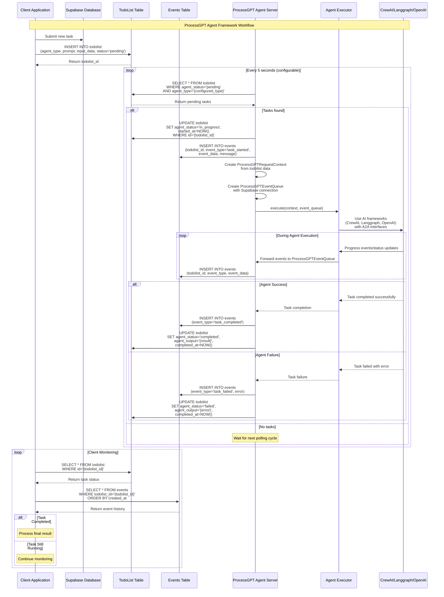

# ProcessGPT Agent Framework

Google A2A SDK의 인터페이스를 활용하면서 웹소켓 대신 Supabase 실시간 DB를 사용하는 에이전트 실행 프레임워크입니다.

## 🏗️ 아키텍처 개요

이 프레임워크는 기존의 Google A2A SDK의 `AgentExecutor`와 `RequestContext` 인터페이스를 그대로 활용하되, 웹소켓 기반 통신 대신 Supabase 데이터베이스를 중간 매개체로 사용합니다.

### 핵심 구성 요소

1. **Supabase Database Tables**
   - `todolist`: 에이전트가 처리해야 할 작업들을 저장
   - `events`: 각 태스크의 실행 상태와 진행 과정을 추적

2. **ProcessGPT Server**
   - Supabase `todolist` 테이블을 폴링하여 대기 중인 작업을 감지
   - Google A2A SDK의 `AgentExecutor.execute()` 메서드를 호출
   - 커스터마이즈된 `EventQueue`를 통해 이벤트를 Supabase에 저장

3. **Custom Classes**
   - `ProcessGPTRequestContext`: todolist 데이터를 기반으로 한 RequestContext 구현
   - `ProcessGPTEventQueue`: Supabase events 테이블에 이벤트를 저장하는 EventQueue 구현

## 📊 데이터베이스 스키마

### TodoList Table
```sql
CREATE TABLE todolist (
    id UUID PRIMARY KEY DEFAULT gen_random_uuid(),
    agent_type VARCHAR(100) NOT NULL,           -- 에이전트 타입 식별자
    prompt TEXT NOT NULL,                       -- 에이전트가 실행할 프롬프트
    input_data JSONB,                          -- 추가 입력 데이터
    agent_status VARCHAR(50) DEFAULT 'pending', -- 실행 상태
    agent_output JSONB,                        -- 실행 결과
    priority INTEGER DEFAULT 0,               -- 우선순위
    created_at TIMESTAMPTZ DEFAULT NOW(),
    updated_at TIMESTAMPTZ DEFAULT NOW(),
    started_at TIMESTAMPTZ,
    completed_at TIMESTAMPTZ
);
```

### Events Table
```sql
CREATE TABLE events (
    id UUID PRIMARY KEY DEFAULT gen_random_uuid(),
    todolist_id UUID NOT NULL REFERENCES todolist(id),
    event_type VARCHAR(50) NOT NULL,           -- 이벤트 타입
    event_data JSONB NOT NULL,                -- 이벤트 상세 데이터
    context_id VARCHAR(255),                  -- A2A 컨텍스트 ID
    task_id VARCHAR(255),                     -- A2A 태스크 ID
    message TEXT,                             -- 이벤트 메시지
    created_at TIMESTAMPTZ DEFAULT NOW()
);
```

## 🚀 사용법

### 1. 환경 설정

```bash
# 의존성 설치
pip install -r requirements.txt

# 환경변수 설정 (.env 파일 생성)
cp env.example .env
# .env 파일에서 Supabase 설정을 입력하세요
```

### 2. 데이터베이스 설정

```sql
-- database_schema.sql의 내용을 Supabase에서 실행
```

### 3. 서버 실행

```bash
# CrewAI Deep Research Agent 서버 실행
cd sample_server
python crew_ai_dr_agent_server.py --agent-type crew-ai-dr --polling-interval 5
```

### 4. 태스크 제출

```python
from supabase import create_client
from processgpt_utils import ProcessGPTClient
import asyncio

# Supabase 클라이언트 초기화
supabase = create_client(
    "https://your-project.supabase.co",
    "your-anon-key"
)

# ProcessGPT 클라이언트 생성
client = ProcessGPTClient(supabase)

async def submit_task_example():
    # 태스크 제출
    todolist_id = await client.submit_task(
        agent_type="crew-ai-dr",
        prompt="Deep research on renewable energy trends",
        input_data={"domain": "energy", "depth": "comprehensive"}
    )
    
    print(f"Task submitted: {todolist_id}")
    
    # 완료까지 대기
    result = await client.wait_for_completion(todolist_id)
    print(f"Task completed: {result}")

# 실행
asyncio.run(submit_task_example())
```

## 🔄 워크플로우

### 시퀀스 다이어그램



### 워크플로우 단계

1. **태스크 제출**: 클라이언트가 `todolist` 테이블에 새로운 작업을 INSERT
2. **폴링**: ProcessGPT Agent Server가 주기적으로 `pending` 상태의 작업들을 조회
3. **상태 업데이트**: 발견된 작업의 상태를 `in_progress`로 변경
4. **컨텍스트 생성**: todolist 데이터를 기반으로 `ProcessGPTRequestContext` 생성
5. **이벤트 큐 생성**: Supabase 연동 `ProcessGPTEventQueue` 생성
6. **에이전트 실행**: Google A2A SDK 인터페이스를 통해 AI 프레임워크(CrewAI, Langgraph, OpenAI) 호출
7. **이벤트 로깅**: 실행 과정의 모든 이벤트가 `events` 테이블에 저장
8. **완료 처리**: 최종 결과가 `todolist`의 `agent_output`에 저장

## 🛠️ 커스터마이제이션

### 새로운 에이전트 타입 추가

1. `AgentExecutor`를 상속받는 새로운 클래스 생성:

```python
from a2a.server.agent_execution import AgentExecutor, RequestContext
from a2a.server.events import EventQueue

class MyCustomAgentExecutor(AgentExecutor):
    async def execute(self, context: RequestContext, event_queue: EventQueue) -> None:
        # 에이전트 로직 구현
        pass
    
    async def cancel(self, context: RequestContext, event_queue: EventQueue) -> None:
        # 취소 로직 구현
        pass
```

2. 새로운 서버 스크립트 생성:

```python
from processgpt_agent_framework import ProcessGPTAgentServer
from my_custom_agent_executor import MyCustomAgentExecutor

agent_executor = MyCustomAgentExecutor()
server = ProcessGPTAgentServer(
    agent_executor=agent_executor,
    agent_type="my-custom-agent"
)

asyncio.run(server.run())
```

### RequestContext 확장

기본 `ProcessGPTRequestContext`를 상속받아 추가 기능을 구현할 수 있습니다:

```python
class ExtendedRequestContext(ProcessGPTRequestContext):
    def __init__(self, todolist_item: TodoListItem):
        super().__init__(todolist_item)
        # 추가 초기화 로직
    
    def get_custom_data(self):
        # 커스텀 데이터 반환 로직
        return self.todolist_item.input_data.get('custom_field')
```

## 📊 모니터링

시스템 상태를 모니터링하기 위한 유틸리티:

```python
from processgpt_utils import ProcessGPTMonitor

monitor = ProcessGPTMonitor(supabase)

# 시스템 통계 조회
stats = await monitor.get_system_stats()
print(f"Total tasks: {stats['total_tasks']}")
print(f"Pending: {stats['pending_tasks']}")
print(f"Completed: {stats['completed_tasks']}")

# 최근 이벤트 조회
recent_events = await monitor.get_recent_events(limit=10)
```

## 🔧 설정 옵션

### 환경변수

```bash
# Supabase 설정
SUPABASE_URL=https://your-project.supabase.co
SUPABASE_ANON_KEY=your-anon-key-here

# 에이전트 설정
DEFAULT_AGENT_TYPE=crew-ai-dr
DEFAULT_POLLING_INTERVAL=5

# 로깅
LOG_LEVEL=INFO
```

### 서버 옵션

```bash
# 폴링 간격 설정 (초)
python server.py --polling-interval 10

# 특정 에이전트 타입만 처리
python server.py --agent-type my-custom-agent
```

## 🐛 트러블슈팅

### 일반적인 문제들

1. **Supabase 연결 실패**
   - 환경변수 `SUPABASE_URL`과 `SUPABASE_ANON_KEY` 확인
   - 네트워크 연결 상태 확인

2. **폴링이 작동하지 않음**
   - 데이터베이스 테이블이 올바르게 생성되었는지 확인
   - `agent_type`이 정확히 매칭되는지 확인

3. **이벤트가 저장되지 않음**
   - Supabase RLS (Row Level Security) 정책 확인
   - 테이블 권한 설정 확인

### 로그 확인

```bash
# 디버그 모드로 실행
LOG_LEVEL=DEBUG python server.py
```

## 🤝 기여

1. Fork the repository
2. Create a feature branch
3. Commit your changes
4. Push to the branch
5. Create a Pull Request

## 📄 라이선스

MIT License - 자세한 내용은 LICENSE 파일을 참조하세요.

## 🔗 관련 링크

- [Google A2A SDK Documentation](https://developers.google.com/a2a)
- [Supabase Documentation](https://supabase.com/docs)
- [ProcessGPT Framework Issues](https://github.com/your-repo/issues) 