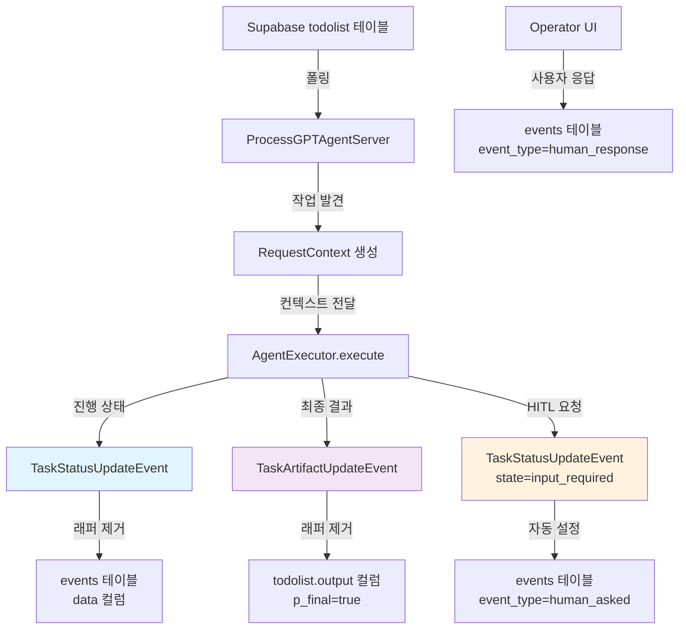
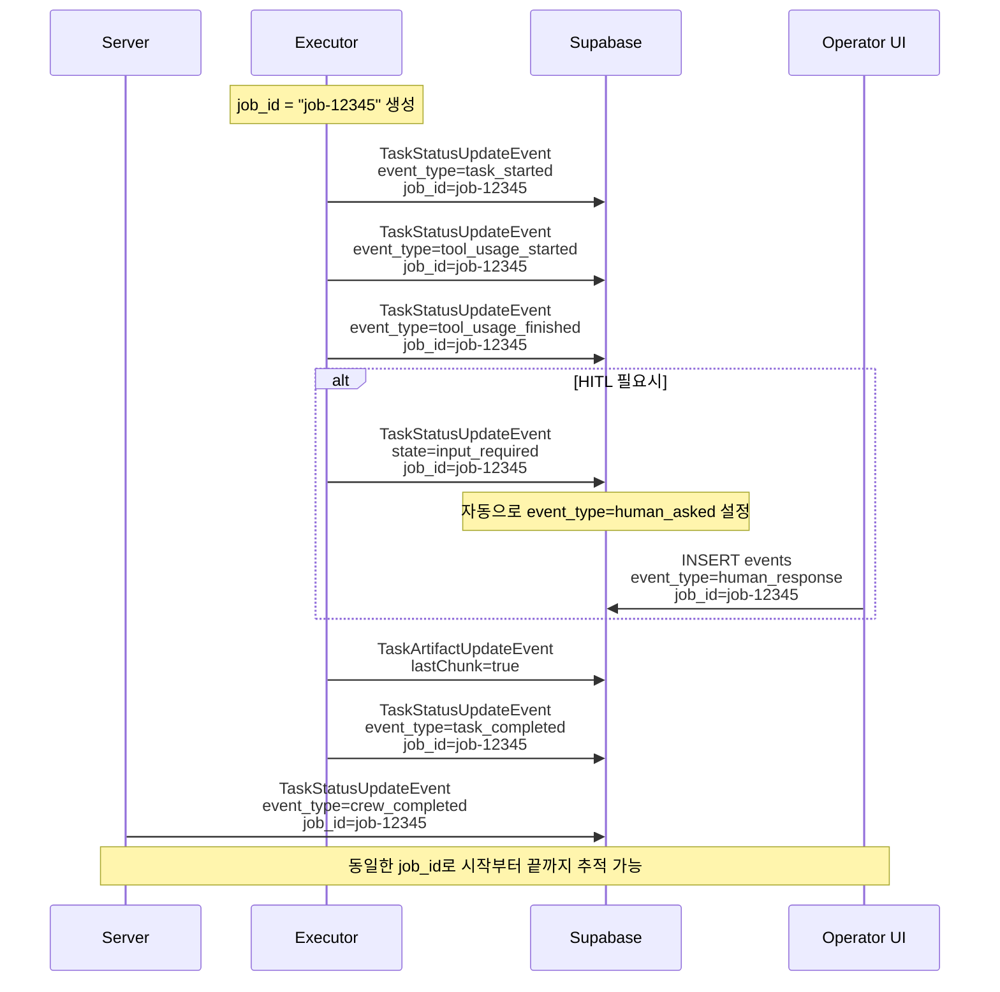

# ProcessGPT Agent Framework
## A2A SDK 연동을 위한 경량 에이전트 서버 프레임워크

Supabase 기반의 프로세스 작업(Todolist)을 폴링하고, A2A 규격 이벤트를 통해 작업 상태/결과를 기록하는 **경량 에이전트 서버 프레임워크**입니다.

### 📋 요구사항
- **런타임**: Python 3.9+ (권장: Python 3.11)
- **데이터베이스**: Supabase (PostgreSQL) + 제공된 RPC/테이블
- **이벤트 규격**: A2A `TaskStatusUpdateEvent` / `TaskArtifactUpdateEvent`

## 📊 이벤트 종류 및 데이터 구조

### 🎯 이벤트 타입 (event_type) 종류

| event_type | 설명 | 사용 시점 | 자동 설정 여부 |
|------------|------|-----------|----------------|
| `task_started` | 작업 시작 | 작업 처리 시작시 | 수동 설정 |
| `task_completed` | 작업 완료 | 작업 정상 완료시 | 수동 설정 |
| `tool_usage_started` | 도구 사용 시작 | 외부 도구/API 호출 시작 | 수동 설정 |
| `tool_usage_finished` | 도구 사용 완료 | 외부 도구/API 호출 완료 | 수동 설정 |
| `human_asked` | 사용자 입력 요청 | HITL 패턴 사용시 | **자동 설정** |
| `human_response` | 사용자 응답 | UI에서 사용자 응답시 | UI가 설정 |

### 📋 메타데이터 필드 설명

#### crew_type (필수)
- **의미**: 현재 조직의 크루 이름 또는 행위를 나타냄
- **예시**: `action`, `report`, `slide`, `analysis`, `research` 등
- **사용법**: 어떤 종류의 작업인지 분류하는 데 사용

```python
metadata = {
    "crew_type": "action",  # 액션 수행 크루
    "event_type": "task_started"
}
```

#### job_id (중요)
- **의미**: 하나의 작업 단위를 식별하는 고유 ID
- **규칙**: **시작과 끝이 반드시 매칭되어야 함**
- **형식**: `job-{task_id}` 또는 `job-{timestamp}` 등

```python
# 올바른 사용법 - 동일한 job_id 사용
job_id = f"job-{task_id}"

# 작업 시작
metadata = {"crew_type": "action", "event_type": "task_started", "job_id": job_id}

# HITL 요청  
metadata = {"crew_type": "action", "job_id": job_id}  # human_asked 자동 설정

# 작업 완료
metadata = {"crew_type": "action", "event_type": "task_completed", "job_id": job_id}
```

### 🔄 이벤트 저장 방식

#### 1. TaskStatusUpdateEvent → `events` 테이블
```python
event_queue.enqueue_event(
    TaskStatusUpdateEvent(
        status={
            "state": TaskState.working,
            "message": new_agent_text_message("진행 상황 메시지", context_id, task_id),
        },
        final=False,
        contextId=context_id,
        taskId=task_id,
        metadata={
            "crew_type": "action",
            "event_type": "task_started",  # events.event_type에 저장
            "job_id": "job-12345"
        }
    )
)
```

**저장 결과** (events 테이블):
- `event_type`: "task_started"
- `data`: "진행 상황 메시지" (래퍼 제거된 순수 텍스트)
- `metadata`: 전체 metadata JSON

#### 2. TaskArtifactUpdateEvent → `todolist.output` 컬럼
```python
artifact = new_text_artifact(
    name="처리결과",
    description="작업 완료 결과",
    text=json.dumps({"result": "완료"}, ensure_ascii=False)
)
event_queue.enqueue_event(
    TaskArtifactUpdateEvent(
        artifact=artifact,
        lastChunk=True,  # 최종 결과
        contextId=context_id,
        taskId=task_id,
    )
)
```

**저장 결과** (todolist 테이블):
- `output`: `{"result": "완료"}` (래퍼 제거된 순수 JSON)
- `p_final`: `true`

### ⚠️ 특별 규칙

1. **자동 event_type 설정**:
   - `state=input_required` → `event_type=human_asked` (자동)
   - 작업 완료시 → `event_type=crew_completed` (서버가 자동 추가)

2. **JSON 문자열 변환 필수**:
   ```python
   # 올바른 방법
   text=json.dumps(data, ensure_ascii=False)
   
   # 잘못된 방법
   text=data  # 딕셔너리 직접 전달 시 래퍼와 함께 저장됨
   ```

## 🔄 전체 데이터 흐름도



### 🎯 job_id 생명주기 흐름



### 💾 데이터 저장 구조

#### events 테이블 저장 예시
```json
{
  "id": "uuid",
  "event_type": "task_started",
  "data": "작업을 시작합니다",  // 래퍼 제거된 순수 메시지
  "metadata": {
    "crew_type": "action",
    "event_type": "task_started", 
    "job_id": "job-12345",
    "contextId": "proc-789",
    "taskId": "task-456"
  },
  "created_at": "2024-01-01T00:00:00Z"
}
```

#### todolist.output 저장 예시  
```json
{
  "id": "task-456",
  "output": {
    "status": "completed",
    "result": "처리 결과 데이터"
  },  // 래퍼 제거된 순수 아티팩트 데이터
  "p_final": true,
  "updated_at": "2024-01-01T00:05:00Z"
}
```

### 🔧 값 전달 과정
```python
# 1. 서버에서 작업 정보 가져오기
row = context.get_context_data()["row"]  # todolist 테이블의 한 행
context_id = row.get("root_proc_inst_id") or row.get("proc_inst_id")  # 프로세스 ID
task_id = row.get("id")  # 작업 ID
user_input = context.get_user_input()  # 사용자가 입력한 내용

# 2. job_id 생성 (작업 전체 추적용)
job_id = f"job-{task_id}"  # 또는 timestamp 기반

# 3. 메시지/아티팩트 생성시 JSON 문자열로 변환
payload = {"result": "처리 완료"}
message_text = json.dumps(payload, ensure_ascii=False)  # 중요: JSON 문자열로!

# 4. 메타데이터에 crew_type, job_id 포함
metadata = {
    "crew_type": "action",  # 크루 타입
    "event_type": "task_started",  # 이벤트 타입
    "job_id": job_id  # 작업 추적 ID
}

# 5. 서버가 자동으로 래퍼 제거 후 순수 payload만 저장
# events.data 또는 todolist.output에 {"result": "처리 완료"}만 저장됨
```

## 🚀 빠른 시작 가이드

### 1단계: 설치
```bash
# 패키지 설치
pip install -e .

# 또는 requirements.txt 사용
pip install -r requirements.txt
```

### 2단계: 환경 설정
`.env` 파일 생성:
```env
SUPABASE_URL=your_supabase_project_url
SUPABASE_KEY=your_supabase_anon_key
ENV=dev
```

### 3단계: 서버 구현 방법
서버는 이렇게 만드세요:

```python
# my_server.py
import asyncio
from dotenv import load_dotenv
from processgpt_agent_sdk.processgpt_agent_framework import ProcessGPTAgentServer
from my_executor import MyExecutor  # 아래에서 구현할 익스큐터

async def main():
    load_dotenv()
    
    server = ProcessGPTAgentServer(
        agent_executor=MyExecutor(),  # 여러분이 구현할 익스큐터
        agent_type="my-agent"  # Supabase todolist.agent_orch와 매칭되어야 함
    )
    server.polling_interval = 3  # 3초마다 새 작업 확인
    
    print("서버 시작!")
    await server.run()

if __name__ == "__main__":
    try:
        asyncio.run(main())
    except KeyboardInterrupt:
        print("서버 종료")
```

### 4단계: 익스큐터 구현 방법
익스큐터는 이렇게 만드세요:

```python
# my_executor.py
import asyncio
import json
from typing_extensions import override
from a2a.server.agent_execution import AgentExecutor, RequestContext
from a2a.server.events import EventQueue
from a2a.types import TaskStatusUpdateEvent, TaskState, TaskArtifactUpdateEvent
from a2a.utils import new_agent_text_message, new_text_artifact

class MyExecutor(AgentExecutor):
    @override
    async def execute(self, context: RequestContext, event_queue: EventQueue) -> None:
        # 1. 작업 정보 가져오기
        row = context.get_context_data()["row"]
        context_id = row.get("root_proc_inst_id") or row.get("proc_inst_id")
        task_id = row.get("id")
        user_input = context.get_user_input()  # 사용자가 입력한 내용
        
        # 2. job_id 생성 (작업 전체 추적용)
        job_id = f"job-{task_id}"
        
        print(f"처리할 작업: {user_input} (job_id: {job_id})")
        
        # 3. 작업 시작 알림 (events 테이블에 저장됨)
        event_queue.enqueue_event(
            TaskStatusUpdateEvent(
                status={
                    "state": TaskState.working,
                    "message": new_agent_text_message("작업 시작", context_id, task_id),
                },
                final=False,
                contextId=context_id,
                taskId=task_id,
                metadata={
                    "crew_type": "action",  # 크루 타입
                    "event_type": "task_started",
                    "job_id": job_id  # 작업 추적 ID
                }
            )
        )
        
        # 4. 실제 작업 수행 (여기에 여러분의 로직 작성)
        await asyncio.sleep(2)
        result_data = {"status": "완료", "input": user_input, "output": "처리 결과"}
        
        # 5. 작업 완료 알림
        event_queue.enqueue_event(
            TaskStatusUpdateEvent(
                status={
                    "state": TaskState.working,
                    "message": new_agent_text_message("작업 완료", context_id, task_id),
                },
                final=False,
                contextId=context_id,
                taskId=task_id,
                metadata={
                    "crew_type": "action",
                    "event_type": "task_completed",
                    "job_id": job_id  # 동일한 job_id 사용
                }
            )
        )
        
        # 6. 최종 결과 전송 (todolist.output에 저장됨)
        artifact = new_text_artifact(
            name="처리결과",
            description="작업 완료 결과",
            text=json.dumps(result_data, ensure_ascii=False)  # JSON 문자열로!
        )
        event_queue.enqueue_event(
            TaskArtifactUpdateEvent(
                artifact=artifact,
                lastChunk=True,  # 중요: 최종 결과면 True
                contextId=context_id,
                taskId=task_id,
            )
        )

    @override
    async def cancel(self, context: RequestContext, event_queue: EventQueue) -> None:
        pass  # 취소 로직 (필요시 구현)
```

### 5단계: 실행
```bash
python my_server.py
```

## 🤝 Human-in-the-Loop (사용자 입력 요청) 패턴

사용자 입력이 필요한 완전한 예시:

```python
class HITLExecutor(AgentExecutor):
    @override
    async def execute(self, context: RequestContext, event_queue: EventQueue) -> None:
        row = context.get_context_data()["row"]
        context_id = row.get("root_proc_inst_id") or row.get("proc_inst_id")
        task_id = row.get("id")
        user_input = context.get_user_input()
        job_id = f"job-{task_id}"
        
        # 1. 작업 시작
        event_queue.enqueue_event(
            TaskStatusUpdateEvent(
                status={
                    "state": TaskState.working,
                    "message": new_agent_text_message("분석을 시작합니다", context_id, task_id),
                },
                final=False,
                contextId=context_id,
                taskId=task_id,
                metadata={
                    "crew_type": "analysis",  # 분석 크루
                    "event_type": "task_started",
                    "job_id": job_id
                }
            )
        )
        
        await asyncio.sleep(1)
        
        # 2. 사용자 입력 요청 (HITL)
        question_data = {
            "question": f"'{user_input}' 작업을 어떤 방식으로 처리할까요?",
            "options": ["빠른 처리", "정밀 분석", "단계별 진행"],
            "context": user_input
        }
        
        event_queue.enqueue_event(
            TaskStatusUpdateEvent(
                status={
                    "state": TaskState.input_required,  # 중요: 자동으로 human_asked 설정됨
                    "message": new_agent_text_message(
                        json.dumps(question_data, ensure_ascii=False),
                        context_id, task_id
                    ),
                },
                final=True,
                contextId=context_id,
                taskId=task_id,
                metadata={
                    "crew_type": "analysis",
                    "job_id": job_id  # 동일한 job_id 유지
                }
            )
        )
        
        # 3. 사용자 응답을 기다리는 로직 (실제 구현에서는 필요)
        # 여기서는 시뮬레이션
        await asyncio.sleep(3)
        
        # 4. 사용자 응답 후 작업 완료
        result_data = {
            "original_request": user_input,
            "user_choice": "사용자가 선택한 옵션",
            "result": "HITL 방식으로 처리 완료"
        }
        
        # 5. 완료 알림
        event_queue.enqueue_event(
            TaskStatusUpdateEvent(
                status={
                    "state": TaskState.working,
                    "message": new_agent_text_message("HITL 처리 완료", context_id, task_id),
                },
                final=False,
                contextId=context_id,
                taskId=task_id,
                metadata={
                    "crew_type": "analysis",
                    "event_type": "task_completed",
                    "job_id": job_id  # 동일한 job_id로 완료
                }
            )
        )
        
        # 6. 최종 결과
        artifact = new_text_artifact(
            name="HITL_결과",
            description="Human-in-the-Loop 처리 결과",
            text=json.dumps(result_data, ensure_ascii=False)
        )
        event_queue.enqueue_event(
            TaskArtifactUpdateEvent(
                artifact=artifact,
                lastChunk=True,
                contextId=context_id,
                taskId=task_id,
            )
        )

    @override
    async def cancel(self, context: RequestContext, event_queue: EventQueue) -> None:
        pass
```

## 📋 체크리스트 (실패 없는 통합을 위한)

### 필수 설정
- [ ] `.env`에 `SUPABASE_URL`, `SUPABASE_KEY` 설정
- [ ] `requirements.txt` 설치 완료
- [ ] Supabase에서 제공 SQL(`database_schema.sql`, `function.sql`) 적용

### 코드 구현
- [ ] 서버에서 `agent_type`이 Supabase `todolist.agent_orch`와 매칭됨
- [ ] 익스큐터에서 `contextId`, `taskId`를 올바르게 설정
- [ ] **job_id 생성 및 일관성 유지** (`job-{task_id}` 형식 권장)
- [ ] **crew_type 설정** (`action`, `report`, `slide` 등 행위별 분류)
- [ ] 상태 이벤트는 `new_agent_text_message()`로 생성
- [ ] 최종 결과는 `new_text_artifact()` + `lastChunk=True`로 전송
- [ ] HITL 요청시 `TaskState.input_required` 사용
- [ ] **JSON 문자열 변환** (`json.dumps(data, ensure_ascii=False)`)

## 🚨 자주 발생하는 문제

### 1. 설치 문제
**증상**: `ModuleNotFoundError`
```bash
# 해결
pip install -e .
pip install a2a-sdk==0.3.0 --force-reinstall
```

### 2. 작업이 폴링되지 않음
**원인**: Supabase 연결 문제
**해결**:
- `.env` 파일 위치 확인 (프로젝트 루트)
- URL/Key 재확인
- `agent_type`이 todolist.agent_orch와 매칭되는지 확인

### 3. 이벤트가 저장되지 않음
**원인**: 테이블/함수 누락
**해결**:
- `database_schema.sql`, `function.sql` 실행 확인
- Supabase 테이블 권한 확인

### 4. 결과가 래퍼와 함께 저장됨
**원인**: JSON 문자열 변환 누락
```python
# 올바른 방법
text=json.dumps(data, ensure_ascii=False)  # JSON 문자열로!

# 잘못된 방법  
text=data  # 딕셔너리 직접 전달 (X)
```

## 📚 샘플 코드 (간단 버전)

### 기본 서버
```python
# sample_server/minimal_server.py
import asyncio
from dotenv import load_dotenv
from processgpt_agent_sdk.processgpt_agent_framework import ProcessGPTAgentServer
from sample_server.minimal_executor import MinimalExecutor

async def main():
    load_dotenv()
    server = ProcessGPTAgentServer(
        agent_executor=MinimalExecutor(), 
        agent_type="crewai-action"
    )
    server.polling_interval = 3
    await server.run()

if __name__ == "__main__":
    try:
        asyncio.run(main())
    except KeyboardInterrupt:
        pass
```

### 기본 익스큐터  
```python
# sample_server/minimal_executor.py
import asyncio
import json
from typing_extensions import override
from a2a.server.agent_execution import AgentExecutor, RequestContext
from a2a.server.events import EventQueue
from a2a.types import TaskStatusUpdateEvent, TaskState, TaskArtifactUpdateEvent
from a2a.utils import new_agent_text_message, new_text_artifact

class MinimalExecutor(AgentExecutor):
    @override
    async def execute(self, context: RequestContext, event_queue: EventQueue) -> None:
        row = context.get_context_data()["row"]
        context_id = row.get("root_proc_inst_id") or row.get("proc_inst_id")
        task_id = row.get("id")
        user_input = context.get_user_input()

        # 진행 상태
        event_queue.enqueue_event(
            TaskStatusUpdateEvent(
                status={
                    "state": TaskState.working,
                    "message": new_agent_text_message("처리중", context_id, task_id),
                },
                final=False,
                contextId=context_id,
                taskId=task_id,
                metadata={"event_type": "task_started"}
            )
        )

        await asyncio.sleep(1)

        # 최종 결과
        result = {"input": user_input, "output": "처리 완료"}
        artifact = new_text_artifact(
            name="결과",
            description="처리 결과",
            text=json.dumps(result, ensure_ascii=False)
        )
        event_queue.enqueue_event(
            TaskArtifactUpdateEvent(
                artifact=artifact,
                lastChunk=True,
                contextId=context_id,
                taskId=task_id,
            )
        )

    @override
    async def cancel(self, context: RequestContext, event_queue: EventQueue) -> None:
        pass
```

## 🔧 실행 방법

### 개발 환경에서 실행
```bash
python sample_server/minimal_server.py
```

### 실제 사용시
```bash
python my_server.py
```

---

## 📚 레퍼런스

### 주요 함수들
- `ProcessGPTAgentServer.run()`: 서버 시작
- `new_agent_text_message(text, context_id, task_id)`: 상태 메시지 생성
- `new_text_artifact(name, desc, text)`: 결과 아티팩트 생성

### 이벤트 저장 규칙
- **TaskStatusUpdateEvent** → `events` 테이블 (`data` 컬럼)
- **TaskArtifactUpdateEvent** → `todolist` 테이블 (`output` 컬럼)
- 래퍼 자동 제거 후 순수 payload만 저장


## 버전업
./release.sh 버전