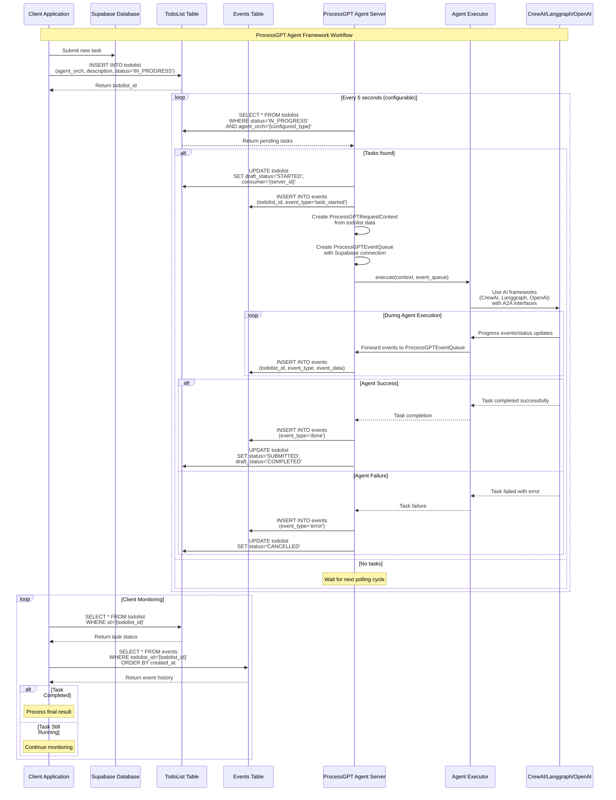

# ProcessGPT Agent Framework

Google A2A SDK의 인터페이스를 활용하면서 ProcessGPT의 Todolist (Supabase)에 쌓인 요청을 처리하도록 하는 에이전트 실행 프레임워크입니다.

## 🏗️ 아키텍처 개요

### 핵심 구성 요소

1. **Process GPT Todo Tables**
   - `todolist`: 에이전트가 처리해야 할 작업들을 저장
   - `events`: 각 태스크의 실행 상태와 진행 과정을 추적

2. **ProcessGPT Server**
   - Supabase `todolist` 테이블을 폴링하여 대기 중인 작업을 감지
   - Google A2A SDK의 `AgentExecutor.execute()` 메서드를 호출
   - 커스터마이즈된 `EventQueue`를 통해 이벤트를 Supabase에 저장

3. **Custom Classes**
   - `ProcessGPTRequestContext`: todolist 데이터를 기반으로 한 RequestContext 구현
   - `ProcessGPTEventQueue`: Supabase events 테이블에 이벤트를 저장하는 EventQueue 구현

## 🚀 빠른 시작 가이드

### 패키지 설치

```
pip install process-gpt-agent-sdk
```

### 1. AgentExecutor 구현

먼저 비즈니스 로직을 처리할 사용자 정의 AgentExecutor를 구현합니다:

```python
import asyncio
from typing import Any, Dict
from a2a.server.agent_execution import AgentExecutor, RequestContext
from a2a.server.events import EventQueue, Event

class MyBusinessAgentExecutor(AgentExecutor):
    """비즈니스 로직을 처리하는 사용자 정의 AgentExecutor"""
    
    def __init__(self, config: Dict[str, Any] = None):
        self.config = config or {}
        self.is_cancelled = False
    
    async def execute(self, context: RequestContext, event_queue: EventQueue) -> None:
        """메인 실행 로직"""
        # 1. 사용자 입력 가져오기
        user_input = context.get_user_input()
        context_data = context.get_context_data()
        
        # 2. 시작 이벤트 발송
        start_event = Event(
            type="task_started",
            data={
                "message": f"작업 시작: {user_input}",
                "user_input": user_input,
                "agent_type": "MyBusinessAgent"
            }
        )
        event_queue.enqueue_event(start_event)

        # 2.5 TODO 메타데이터 접근
        todo_record = context_data.get("row", {})
        extras = context_data.get("extras", {})
        proc_inst_id = todo_record.get("root_proc_inst_id") or row.get("proc_inst_id")
        task_id = todo_record.get("id")
        tenant_id = todo_record.get("tenant_id")
        form_id = extras.get("form_id")   # 결과 Form ID
        form_fields = extras.get("form_fields")   # 결과 Form Scheme
        
        try:
            # 3. 작업 단계별 처리
            await self._process_business_logic(user_input, context_data, event_queue)
            
            # 4. 성공 완료 이벤트
            if not self.is_cancelled:
                success_event = Event(
                    type="done",
                    data={
                        "message": "작업이 성공적으로 완료되었습니다",
                        "success": True
                    }
                )
                event_queue.enqueue_event(success_event)
                
        except Exception as e:
            # 5. 오류 이벤트
            error_event = Event(
                type="error",
                data={
                    "message": f"작업 처리 중 오류 발생: {str(e)}",
                    "error": str(e)
                }
            )
            event_queue.enqueue_event(error_event)
            raise
    
    async def cancel(self, context: RequestContext, event_queue: EventQueue) -> None:
        """작업 취소 처리"""
        self.is_cancelled = True
        
        cancel_event = Event(
            type="cancelled",
            data={
                "message": "작업이 취소되었습니다",
                "cancelled_by": "user_request"
            }
        )
        event_queue.enqueue_event(cancel_event)
    
    async def _process_business_logic(self, user_input: str, context_data: Dict[str, Any], event_queue: EventQueue):
        """실제 비즈니스 로직 처리"""
        steps = [
            ("분석", "사용자 요청을 분석하고 있습니다..."),
            ("계획", "처리 계획을 수립하고 있습니다..."),
            ("실행", "작업을 실행하고 있습니다..."),
            ("검증", "결과를 검증하고 있습니다..."),
            ("완료", "최종 결과를 준비하고 있습니다...")
        ]
        
        for i, (step_name, step_message) in enumerate(steps, 1):
            if self.is_cancelled:
                break
            
            # 진행 상황 이벤트
            progress_event = Event(
                type="progress",
                data={
                    "step": i,
                    "total_steps": len(steps),
                    "step_name": step_name,
                    "message": step_message,
                    "progress_percentage": (i / len(steps)) * 100
                }
            )
            event_queue.enqueue_event(progress_event)
            
            # 실제 작업 수행 (여기에 AI 모델 호출, 데이터 처리 등)
            await asyncio.sleep(1.0)  # 시뮬레이션용 지연
        
        # 최종 결과 출력
        if not self.is_cancelled:
            result = await self._generate_final_result(user_input, context_data)
            
            output_event = Event(
                type="output",
                data={
                    "content": result,
                    "final": True
                }
            )
            event_queue.enqueue_event(output_event)
    
    async def _generate_final_result(self, user_input: str, context_data: Dict[str, Any]) -> Dict[str, Any]:
        """최종 결과 생성"""
        return {
            "input": user_input,
            "result": f"'{user_input}' 요청이 성공적으로 처리되었습니다.",
            "processed_at": "2024-01-15T10:30:45Z",
            "agent_type": "MyBusinessAgent",
            "status": "completed"
        }
```

### 2. ProcessGPTAgentServer 생성 및 시작

AgentExecutor를 사용하여 ProcessGPT 서버를 생성하고 실행합니다:

```python
import asyncio
import os
from processgpt_agent_sdk import ProcessGPTAgentServer
from my_custom_executor import MyBusinessAgentExecutor

async def main():
    """ProcessGPT 서버 메인 함수"""
    
    # 1. 환경변수 확인
    if not os.getenv("SUPABASE_URL") or not os.getenv("SUPABASE_ANON_KEY"):
        print("오류: SUPABASE_URL과 SUPABASE_ANON_KEY 환경변수가 필요합니다.")
        return
    
    # 2. 사용자 정의 실행기 생성
    executor = MyBusinessAgentExecutor(config={"timeout": 30})
    
    # 3. ProcessGPT 서버 생성
    server = ProcessGPTAgentServer(
        executor=executor,
        polling_interval=5,  # 5초마다 폴링
        agent_orch="my_business_agent"  # 에이전트 타입 식별자
    )
    
    print("ProcessGPT 서버 시작...")
    print(f"에이전트 타입: my_business_agent")
    print(f"폴링 간격: 5초")
    print("Ctrl+C로 서버를 중지할 수 있습니다.")
    
    try:
        # 4. 서버 실행 (무한 루프)
        await server.run()
    except KeyboardInterrupt:
        print("\n서버 중지 요청...")
        server.stop()
        print("서버가 정상적으로 중지되었습니다.")

if __name__ == "__main__":
    asyncio.run(main())
```

실행하기:

```bash
# 서버 실행
python my_server.py
```

### 3. Supabase 구성

#### 3.1 Supabase 프로젝트 설정

1. [Supabase](https://supabase.com) 에서 새 프로젝트 생성
2. 프로젝트 설정에서 API 키 복사
3. 환경변수 설정:

```bash
# .env 파일 생성
echo "SUPABASE_URL=https://your-project.supabase.co" >> .env
echo "SUPABASE_ANON_KEY=your-anon-key-here" >> .env
```

#### 3.2 데이터베이스 스키마 생성

Supabase SQL Editor에서 다음 스키마를 실행:

```sql
-- 1. 테이블 타입 정의
CREATE TYPE todo_status AS ENUM (
    'PENDING', 'IN_PROGRESS', 'DONE', 'CANCELLED', 'SUBMITTED'
);

CREATE TYPE agent_mode AS ENUM (
    'DRAFT', 'COMPLETE'
);

CREATE TYPE agent_orch AS ENUM (
    'my_business_agent', 'data_analyst', 'customer_service', 'project_manager'
);

CREATE TYPE draft_status AS ENUM (
    'STARTED', 'COMPLETED', 'FB_REQUESTED'
);

-- 2. TodoList 테이블 생성
CREATE TABLE IF NOT EXISTS todolist (
    id UUID PRIMARY KEY DEFAULT gen_random_uuid(),
    user_id TEXT NOT NULL,
    proc_inst_id TEXT,
    proc_def_id TEXT,
    activity_id TEXT,
    activity_name TEXT NOT NULL,
    start_date TIMESTAMP DEFAULT NOW(),
    end_date TIMESTAMP,
    description TEXT NOT NULL,
    tool TEXT,
    due_date TIMESTAMP,
    tenant_id TEXT NOT NULL,
    reference_ids TEXT[],
    adhoc BOOLEAN DEFAULT FALSE,
    assignees JSONB,
    duration INTEGER,
    output JSONB,
    retry INTEGER DEFAULT 0,
    consumer TEXT,
    log TEXT,
    draft JSONB,
    project_id UUID,
    feedback JSONB,
    updated_at TIMESTAMPTZ DEFAULT NOW(),
    username TEXT,
    status todo_status DEFAULT 'PENDING',
    agent_mode agent_mode DEFAULT 'COMPLETE',
    agent_orch agent_orch DEFAULT 'my_business_agent',
    temp_feedback TEXT,
    draft_status draft_status
);

-- 3. Events 테이블 생성
CREATE TABLE IF NOT EXISTS events (
    id UUID PRIMARY KEY DEFAULT gen_random_uuid(),
    todolist_id UUID NOT NULL REFERENCES todolist(id),
    event_type VARCHAR(50) NOT NULL,
    event_data JSONB NOT NULL,
    context_id VARCHAR(255),
    task_id VARCHAR(255),
    message TEXT,
    created_at TIMESTAMPTZ DEFAULT NOW()
);

-- 4. 인덱스 생성
CREATE INDEX IF NOT EXISTS idx_todolist_status_agent ON todolist(status, agent_orch);
CREATE INDEX IF NOT EXISTS idx_todolist_proc_inst ON todolist(proc_inst_id);
CREATE INDEX IF NOT EXISTS idx_events_todolist_id ON events(todolist_id);
CREATE INDEX IF NOT EXISTS idx_events_created_at ON events(created_at);
```

#### 3.3 필수 함수 생성

프로젝트에 포함된 `function.sql` 파일을 Supabase에서 실행:

```bash
# SQL 파일 내용을 Supabase SQL Editor에 복사하여 실행
cat function.sql
```

### 4. SQL Insert로 테스트

#### 4.1 직접 SQL 테스트

Supabase SQL Editor에서 테스트 작업 생성:

```sql
-- 테스트 작업 삽입
INSERT INTO todolist (
    user_id,
    proc_inst_id,
    activity_name,
    description,
    tenant_id,
    agent_orch,
    status
) VALUES (
    'test-user-001',
    'proc-inst-' || gen_random_uuid()::text,
    'data_analysis_task',
    '월별 매출 데이터를 분석하고 트렌드를 파악해주세요',
    'test-tenant-001',
    'my_business_agent',
    'IN_PROGRESS'
);

-- 삽입된 작업 확인
SELECT id, description, status, agent_orch, created_at 
FROM todolist 
ORDER BY created_at DESC 
LIMIT 5;
```


---

## 🎮 ProcessGPT Agent Simulator

**데이터베이스 연결 없이** ProcessGPT 에이전트를 시뮬레이션할 수 있는 완전한 툴킷이 제공됩니다. 개발, 테스트, 데모 목적으로 사용할 수 있습니다.

### 🎯 주요 특징

- **데이터베이스 불필요**: Supabase 연결 없이 완전한 독립 실행
- **스마트 프로세스 선택**: 프롬프트 분석으로 자동 프로세스 결정
- **실시간 이벤트 출력**: JSON 형태로 진행상태를 stdout에 출력
- **사용자 정의 가능**: 자체 실행기 구현 지원
- **다양한 시뮬레이션 모드**: 단계별 진행, 지연 시간 조정 등


### 📊 출력 형태

시뮬레이터는 각 이벤트를 JSON 형태로 stdout에 출력합니다:

```json
[EVENT] {
  "timestamp": "2024-01-15T10:30:45.123456Z",
  "task_id": "550e8400-e29b-41d4-a716-446655440000",
  "proc_inst_id": "550e8400-e29b-41d4-a716-446655440001",
  "event": {
    "type": "progress",
    "data": {
      "step": 2,
      "total_steps": 5,
      "step_name": "데이터 정제",
      "message": "데이터를 정제하고 전처리하고 있습니다...",
      "progress_percentage": 40.0,
      "process_type": "데이터 분석"
    }
  }
}
```


### 시뮬레이터에서 사용자 정의 실행기 사용

```python
# 시뮬레이터에서 사용자 정의 실행기 사용 예제
from processgpt_agent_sdk.simulator import ProcessGPTAgentSimulator
from my_custom_executor import MyBusinessAgentExecutor

async def main():
    # 사용자 정의 실행기 생성
    executor = MyBusinessAgentExecutor(config={"timeout": 30})
    
    # 시뮬레이터 생성
    simulator = ProcessGPTAgentSimulator(
        executor=executor,
        agent_orch="my_business_agent"
    )
    
    # 시뮬레이션 실행
    await simulator.run_simulation(
        prompt="월별 매출 보고서를 작성해주세요",
        activity_name="report_generation",
        user_id="user123",
        tenant_id="tenant456"
    )

# 실행
if __name__ == "__main__":
    asyncio.run(main())
```


## 🔄 워크플로우

### 시퀀스 다이어그램


```mermaid
sequenceDiagram
    participant Client as Client Application
    participant DB as Supabase Database
    participant TodoTable as TodoList Table
    participant EventTable as Events Table
    participant Server as ProcessGPT Agent Server
    participant Executor as Agent Executor
    participant AI as CrewAI/Langgraph/OpenAI

    Note over Client, AI: ProcessGPT Agent Framework Workflow

    %% Task Submission
    Client->>DB: Submit new task
    Client->>TodoTable: INSERT INTO todolist<br/>(agent_orch, description, status='IN_PROGRESS')
    TodoTable-->>Client: Return todolist_id

    %% Server Polling Loop
    loop Every 5 seconds (configurable)
        Server->>TodoTable: SELECT * FROM todolist<br/>WHERE status='IN_PROGRESS'<br/>AND agent_orch='{configured_type}'
        TodoTable-->>Server: Return pending tasks
        
        alt Tasks found
            Server->>TodoTable: UPDATE todolist<br/>SET draft_status='STARTED',<br/>consumer='{server_id}'
            
            %% Event Logging - Task Started
            Server->>EventTable: INSERT INTO events<br/>(todolist_id, event_type='task_started')
            
            %% Create Request Context
            Server->>Server: Create ProcessGPTRequestContext<br/>from todolist data
            
            %% Create Event Queue
            Server->>Server: Create ProcessGPTEventQueue<br/>with Supabase connection
            
            %% Execute Agent
            Server->>Executor: execute(context, event_queue)
            
            %% Agent Processing with AI Frameworks
            Executor->>AI: Use AI frameworks<br/>(CrewAI, Langgraph, OpenAI)<br/>with A2A interfaces
            
            loop During Agent Execution
                AI->>Executor: Progress events/status updates
                Executor->>Server: Forward events to ProcessGPTEventQueue
                Server->>EventTable: INSERT INTO events<br/>(todolist_id, event_type, event_data)
            end
            
            alt Agent Success
                AI-->>Executor: Task completed successfully
                Executor-->>Server: Task completion
                Server->>EventTable: INSERT INTO events<br/>(event_type='done')
                Server->>TodoTable: UPDATE todolist<br/>SET status='SUBMITTED',<br/>draft_status='COMPLETED'
            else Agent Failure
                AI-->>Executor: Task failed with error
                Executor-->>Server: Task failure
                Server->>EventTable: INSERT INTO events<br/>(event_type='error')
                Server->>TodoTable: UPDATE todolist<br/>SET status='CANCELLED'
            end
        else No tasks
            Note over Server: Wait for next polling cycle
        end
    end

    %% Client Status Monitoring
    loop Client Monitoring
        Client->>TodoTable: SELECT * FROM todolist<br/>WHERE id='{todolist_id}'
        TodoTable-->>Client: Return task status
        
        Client->>EventTable: SELECT * FROM events<br/>WHERE todolist_id='{todolist_id}'<br/>ORDER BY created_at
        EventTable-->>Client: Return event history
        
        alt Task Completed
            Note over Client: Process final result
        else Task Still Running
            Note over Client: Continue monitoring
        end
    end
```

### 워크플로우 단계

1. **태스크 제출**: 클라이언트가 `todolist` 테이블에 새로운 작업을 INSERT
2. **폴링**: ProcessGPT Agent Server가 주기적으로 `IN_PROGRESS` 상태의 작업들을 조회
3. **상태 업데이트**: 발견된 작업의 상태를 `STARTED`로 변경
4. **컨텍스트 생성**: todolist 데이터를 기반으로 `ProcessGPTRequestContext` 생성
5. **이벤트 큐 생성**: Supabase 연동 `ProcessGPTEventQueue` 생성
6. **에이전트 실행**: Google A2A SDK 인터페이스를 통해 AI 프레임워크(CrewAI, Langgraph, OpenAI) 호출
7. **이벤트 로깅**: 실행 과정의 모든 이벤트가 `events` 테이블에 저장
8. **완료 처리**: 최종 결과가 `todolist`의 `output` 또는 `draft`에 저장

## 🛠️ 커스터마이제이션

### CrewAI 통합 예제

https://github.com/uengine-oss/process-gpt-crewai-action/blob/main/crewai_action_executor.py


## 📄 라이선스

MIT License - 자세한 내용은 LICENSE 파일을 참조하세요.

## 🔗 관련 링크

- [Google A2A SDK Documentation](https://developers.google.com/a2a)
- [Supabase Documentation](https://supabase.com/docs)
- [CrewAI Documentation](https://docs.crewai.com/)
- [LangGraph Documentation](https://langchain-ai.github.io/langgraph/)
- [ProcessGPT Framework Issues](https://github.com/your-repo/issues)
