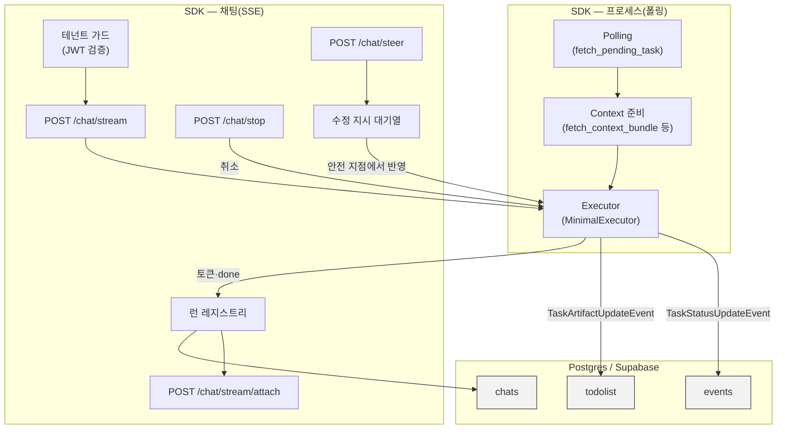

# 📘 ProcessGPT Agent SDK – README

## 1. 이게 뭐하는 건가요?
이 SDK는 **ProcessGPT 에이전트 서버**를 만들 때 필요한 **공통 기능**을 제공합니다.  

- DB에서 **작업(todo) 폴링** → 처리할 일감 가져오기  
- **컨텍스트 준비** (사용자 정보, 폼 정의, MCP 설정 등 자동으로 조회)  
- 다양한 **에이전트 오케스트레이션(A2A)** 과 호환  
- **이벤트(Event) 전송 규격 통일화** → 결과를 DB에 안전하게 저장  
- **채팅(SSE) 전송 계층** → 하트비트 · 재접속(attach) · 중지(stop) 를 프레임워크가 제공  
- **테넌트 인증** → 요청이 보낸 `tenant_id` 를 요청자의 JWT 로 검증  
- **에이전트 산출물** → 만든 파일을 비공개 버킷에 보관하고 만료되는 서명 주소로 내줌  

👉 쉽게 말하면: **여러 종류의 AI 에이전트를 같은 규칙으로 실행/저장/호출할 수 있게 해주는 통합 SDK** 입니다.  

> **0.8.0 에서 달라진 점**  
> 에이전트가 만든 파일을 사용자에게 내주는 일이 SDK 로 올라왔습니다. 그동안 에이전트마다
> 따로 만들어 쓰던 수집·보관·본문 링크 치환을 `processgpt_agent_sdk.artifacts` 하나로
> 대체합니다. 산출물은 비공개 버킷에 들어가고 주소는 한 시간짜리 서명 주소이며, 만료되면
> `file_id` 로 다시 발급받습니다. 자세한 내용은 7 을 보세요.
> 0.8.1 부터는 산출물이 SSE `done` 에도 실려 나갑니다(7.5).

> **0.5.0 에서 달라진 점**  
> 채팅 SSE 전송 계층과 테넌트 인증이 SDK 로 올라왔습니다. 그동안 각 에이전트
> 저장소가 따로 만들어 쓰던 하트비트·재접속·중지·인증을 `mount_chat_routes()`
> 한 번으로 대체할 수 있습니다. 자세한 내용은 4.5 · 4.6 을 보세요.
> 기존 `mount_chat_sse()` 단독 호출은 동작이 그대로라 곧바로 올려도 깨지지 않습니다.

---

## 2. 아키텍처 다이어그램

```mermaid
flowchart TD
    subgraph DB["Postgres / Supabase"]
        T["todolist"]:::db
        E["events"]:::db
        CH["chats"]:::db
    end

    subgraph SDK["SDK — 프로세스(폴링)"]
        P["Polling<br/>(fetch_pending_task)"] --> C["Context 준비<br/>(fetch_context_bundle 등)"]
        C --> X["Executor<br/>(MinimalExecutor)"]
    end

    subgraph CHAT["SDK — 채팅(SSE)"]
        G["테넌트 가드<br/>(JWT 검증)"] --> S["POST /chat/stream"]
        R["런 레지스트리"] --> A["POST /chat/stream/attach"]
        K["POST /chat/stop"]
        ST["POST /chat/steer"] --> Q["수정 지시 대기열"]
    end

    S --> X
    K -->|취소| X
    Q -->|안전 지점에서 반영| X
    X -->|TaskStatusUpdateEvent| E
    X -->|TaskArtifactUpdateEvent| T
    X -->|토큰·done| R
    R --> CH

    classDef db fill:#f2f2f2,stroke:#333,stroke-width:1px;
```

- **todolist**: 각 작업(Task)의 진행 상태, 결과물 저장  
- **events**: 실행 중간에 발생한 이벤트 로그 저장  
- **chats**: 채팅 턴의 최종 응답 저장  
- SDK는 세 테이블을 자동으로 연결해 줍니다.  
- 채팅 경로는 요청이 Executor 에 닿기 전에 테넌트를 검증하고, 턴이 내보내는
  이벤트를 런 레지스트리에 남겨 재접속·중지가 가능하게 합니다.  

---

## 3. A2A 타입과 이벤트 종류

### A2A 타입 (2가지)
| A2A 타입 | 설명 | 매칭 테이블 |
|----------|------|-------------|
| **TaskStatusUpdateEvent** | 작업 상태 업데이트 | `events` 테이블 |
| **TaskArtifactUpdateEvent** | 작업 결과물 업데이트 | `todolist` 테이블 |

### (v1.0) Enum 변경사항: `snake_case` → `SCREAMING_SNAKE_CASE`

`a2a-sdk` v1.0부터 A2A 스펙(ProtoJSON) 정합성을 위해 **모든 enum 값이 대문자 스네이크 케이스로 표준화**되었습니다.

- **TaskState**
  - `TaskState.submitted` → `TaskState.TASK_STATE_SUBMITTED`
  - `TaskState.working` → `TaskState.TASK_STATE_WORKING`
  - `TaskState.completed` → `TaskState.TASK_STATE_COMPLETED`
  - `TaskState.failed` → `TaskState.TASK_STATE_FAILED`
  - `TaskState.canceled` → `TaskState.TASK_STATE_CANCELED`
  - `TaskState.input_required` → `TaskState.TASK_STATE_INPUT_REQUIRED`
  - `TaskState.auth_required` → `TaskState.TASK_STATE_AUTH_REQUIRED`
  - `TaskState.rejected` → `TaskState.TASK_STATE_REJECTED`
  - (추가) `TaskState.TASK_STATE_UNSPECIFIED`

- **Role**
  - `Role.user` → `Role.ROLE_USER`
  - `Role.agent` → `Role.ROLE_AGENT`
  - (추가) `Role.ROLE_UNSPECIFIED`

### `events.event_type` enum 매핑

DB 의 `events.event_type` 컬럼은 enum 입니다. Executor 가 emit한 `TaskStatusUpdateEvent` 가 `events` 테이블에 저장될 때 어떤 enum 값으로 들어가는지는 다음과 같이 결정됩니다.

| event_type (DB enum) | 발행 주체 | A2A 이벤트 형태 | 매핑 방식 |
|---|---|---|---|
| `task_started` | Executor | `TaskStatusUpdateEvent(state=SUBMITTED)` | **자동** (state 기반) |
| `task_completed` | Executor | `TaskStatusUpdateEvent(state=COMPLETED)` | **자동** (state 기반) |
| `error` | Executor | `TaskStatusUpdateEvent(state=FAILED)` | **자동** (state 기반) |
| `human_asked` | Executor | `TaskStatusUpdateEvent(state=INPUT_REQUIRED)` | **자동** (state 기반) |
| `task_working` | Executor | `TaskStatusUpdateEvent(state=WORKING)` + `metadata["event_type"]="task_working"` | 명시 |
| `tool_usage_started` / `tool_usage_finished` | Executor | `TaskStatusUpdateEvent(state=WORKING)` + `metadata["event_type"]="tool_usage_*"` | 명시 (sub-event, 아래 참조) |
| `crew_completed` | SDK | (Executor 가 emit X) | **자동** — `TaskArtifactUpdateEvent(last_chunk=True)` 처리 시점에 SDK 가 발행 (안전망: framework 의 `task_done()`) |

> **자동 매핑 규칙**: SDK 는 다음 lifecycle state 를 자동으로 enum 값으로 매핑합니다.
> - `TASK_STATE_SUBMITTED` → `task_started`
> - `TASK_STATE_COMPLETED` → `task_completed`
> - `TASK_STATE_FAILED` → `error`
> - `TASK_STATE_INPUT_REQUIRED` → `human_asked`
>
> `TASK_STATE_WORKING` 은 의도적으로 자동 매핑 대상이 아닙니다. WORKING 은 너무 광범위하고 도메인 sub-event(`tool_usage_*` 등) 의 베이스로도 재사용되므로, sub-event 의미와 충돌하지 않도록 NULL 로 두거나 `metadata["event_type"]` 으로 명시하세요. metadata 가 없으면 `event_type` 컬럼은 NULL 로 저장됩니다(허용됨).
>
> **명시 vs 자동 우선순위**: `metadata["event_type"]` 가 있으면 자동 매핑보다 우선합니다 (explicit > implicit). 예: `state=WORKING + metadata["event_type"]="tool_usage_started"` → `tool_usage_started` 로 저장.
>
> **사람에게 묻고 끝난 실행 (`INPUT_REQUIRED`)**: 실행 중 `INPUT_REQUIRED` 를 낸 뒤 (`WORKING`/`COMPLETED` 로 이어지지 않고) 끝나면 SDK 는 그 실행을 완료로 보지 않습니다. 뒤따르는 `TaskArtifactUpdateEvent(last_chunk=True)` 는 질문 본문으로 보고 todolist 결과(`output`/`draft`)에 저장하지 않으며, `crew_completed` 도 내지 않습니다. 대신 작업을 `draft_status='HUMAN_ASKED'` 로 두고 점유(consumer, lease)를 풉니다 — `status` 는 `IN_PROGRESS` 그대로입니다. 사용자가 답하면 화면이 `FB_REQUESTED` 로 바꾸고 워커가 다시 집습니다. 아티팩트 없이 상태만 내고 끝나도 같습니다. 이 규칙이 없으면 COMPLETE 모드에서 질문이 산출물로 `SUBMITTED` 되어 프로세스가 다음 단계로 넘어갑니다.
>
> **`task_completed` vs `TaskArtifactUpdateEvent`**: 둘은 별개입니다. `task_completed` 는 events 테이블의 lifecycle 표시이고, 실제 결과물 저장은 `TaskArtifactUpdateEvent(last_chunk=True)` 가 todolist 테이블에 수행합니다.

### A2A 타입 = 라우팅 키 (SDK 는 dumb transport)

**원칙**: Executor 는 A2A 표준 이벤트와 표준 필드만 emit. SDK 는 매직 메타데이터 없이 **A2A 이벤트 타입 자체를 라우팅 키로** 사용합니다. 필터링은 Executor 책임이고 SDK 는 받은 대로 라우팅합니다.

**라우팅 매트릭스**:

| A2A 이벤트 타입 | ChatEventQueue | ProcessEventQueue |
|---|---|---|
| `Task` (라이프사이클 마커) | silently ignore | silently ignore |
| `Message` | SSE `{"type":"token","content":...}` (반복 허용 = 토큰 스트리밍) | silently ignore |
| `TaskStatusUpdateEvent` | silently ignore | events 테이블 저장 (state/text 그대로) |
| `TaskArtifactUpdateEvent(last_chunk=True)` | SSE `done` + chats 저장 | todolist 저장 (`is_final=True`) |

**Executor 의 표준 흐름 (LLM 스트리밍 예시)**:
1. `Task` (state=SUBMITTED) — 라이프사이클 시작
2. 토큰마다:
   - `Message(text=token)` — 채팅용
   - `TaskStatusUpdateEvent(state=WORKING, text=token)` — 프로세스용 (필요 시 JSON payload)
3. `TaskStatusUpdateEvent(state=COMPLETED, text=full)` — 종료 알림 (선택)
4. `TaskArtifactUpdateEvent(last_chunk=True, text=full)` — 최종 결과

> 부하 우려가 있다면 (예: events 테이블에 토큰 row 가 너무 많이 쌓일 경우) Executor 가 직접 필터링/집계하세요. SDK 는 정책을 강제하지 않습니다.

### 도메인 sub-event 기록 (도구 호출 등)

`tool_usage_started`, `tool_usage_finished` 같은 도메인 sub-event 는 A2A `TaskState` 에 직접 매핑되지 않습니다 — `TaskState` 는 작업 전체의 lifecycle (SUBMITTED → WORKING → COMPLETED/FAILED) 추상화이고, 도구 호출은 그 안에서 일어나는 세부 사건입니다.

이런 sub-event 는 `state=TASK_STATE_WORKING` 그대로 두고, **`metadata["event_type"]`** 로 enum 값을 명시하세요. SDK 가 그 값을 `events.event_type` 컬럼에 그대로 기록합니다. `data` 컬럼에는 `text` 로 실은 JSON payload (도구 이름, 인자, 결과 등) 가 저장됩니다.

```python
import json
from a2a.helpers import new_text_status_update_event
from a2a.types import TaskState

# 도구 호출 시작
evt_start = new_text_status_update_event(
    task_id=task_id, context_id=context_id,
    state=TaskState.TASK_STATE_WORKING,
    text=json.dumps(
        {"tool": "web_search", "args": {"query": "process-gpt"}},
        ensure_ascii=False,
    ),
)
evt_start.metadata.update({"event_type": "tool_usage_started"})
await event_queue.enqueue_event(evt_start)

# ... 도구 실제 호출 ...

# 도구 호출 종료
evt_end = new_text_status_update_event(
    task_id=task_id, context_id=context_id,
    state=TaskState.TASK_STATE_WORKING,
    text=json.dumps(
        {"tool": "web_search", "result_summary": "...", "elapsed_ms": 312},
        ensure_ascii=False,
    ),
)
evt_end.metadata.update({"event_type": "tool_usage_finished"})
await event_queue.enqueue_event(evt_end)
```

> **TaskState 는 lifecycle, metadata 는 도메인 분류**: A2A 표준 envelope 안에 머무르면서 도메인 이벤트도 enum 으로 정확히 기록할 수 있는 방식입니다. `metadata` 자체는 A2A `TaskStatusUpdateEvent` 의 표준 free-form 필드라 "A2A 표준만 사용" 원칙과 충돌하지 않습니다.
> 
> **빈도 주의**: tool_usage 는 trace 성격이라 LLM 한 번에 도구 5번 호출하면 events row 10개가 쌓입니다. 너무 빈번하면 Executor 측에서 sampling/aggregation 을 적용하거나, 결과만 한 번에 묶어 emit 하세요. `tool_usage_*` 는 **도구 호출 단위**에서만 emit하고, 토큰 스트리밍 루프 안에는 절대 넣지 마세요.

---

## 4. 사용 예시

이 SDK는 “하나의 완제품 서비스”가 아니라, **내 서비스에 붙여서 사용하는 프레임워크/라이브러리**입니다.

아래 예시는 한 프로세스에서 다음을 동시에 제공합니다.

- **프로세스(폴링)**: `await server.run()`로 DB에서 todo를 가져와 처리
- **채팅(SSE)**: `/chat/stream` 엔드포인트로 요청을 받아 `Message-only`로 응답 + `chats`에 저장
- **채팅 부가 라우트**: `/chat/stream/attach`(재접속) · `/chat/stop`(중지) · `/chat/steer`(수정 지시)

### 4.1 서버 구성 예시 (폴링 + SSE 함께)

```python
import asyncio

import uvicorn
from starlette.applications import Starlette

from processgpt_agent_sdk import ProcessGPTAgentServer
from my_service.my_executor import MyExecutor


async def main():
    server = ProcessGPTAgentServer(
        agent_executor=MyExecutor(),
        agent_type="langchain-react",
        # 요청 본문의 tenant_id 를 요청자의 JWT 로 검증한다(기본값). 4.6 참고.
        tenant_auth=True,
    )

    app = Starlette()
    # /chat/stream · /chat/stream/attach · /chat/stop · /chat/steer 를 한 번에 붙이고,
    # tenant_auth 가 켜져 있으면 스트림 경로에 검증 미들웨어도 건다.
    server.mount_chat_routes(app)

    uvicorn_server = uvicorn.Server(
        uvicorn.Config(app, host="127.0.0.1", port=8010, log_level="info")
    )

    await asyncio.gather(
        server.run(),
        uvicorn_server.serve(),
    )


if __name__ == "__main__":
    asyncio.run(main())
```

> 스트림 하나만 필요하면 `mount_chat_sse(app, path="/chat/stream")` 를 그대로 쓸 수
> 있습니다(하트비트와 런 레지스트리는 이 경로에도 적용됩니다). 다만 재접속·중지
> 라우트와 테넌트 검증 미들웨어는 `mount_chat_routes()` 만 붙여 줍니다.

### 4.2 Executor 구현 예시 (A2A 표준만 사용)

> **제 1원칙**: Executor 는 A2A 표준 이벤트만 emit. SDK 매직 메타데이터(`metadata.update({"type":"token",...})` 같은) 일절 사용 금지. **A2A 이벤트 타입 자체가 라우팅 키.**

이벤트 흐름:
1. `Task(state=SUBMITTED)` — 라이프사이클 시작
2. 토큰마다:
   - `Message(text=token)` — 채팅(SSE) 토큰 청크. ChatEventQueue 가 처리.
   - `TaskStatusUpdateEvent(state=WORKING, text=token)` — 프로세스 진행. ProcessEventQueue 가 events 테이블에 저장.
3. `TaskStatusUpdateEvent(state=COMPLETED, text=full)` — 종료 알림 (선택)
4. `TaskArtifactUpdateEvent(last_chunk=True, text=full)` — 최종 결과. 둘 다 처리 (chats / todolist).

> 도구 호출 같은 도메인 sub-event 는 위 코드 흐름과 별개로, "도메인 sub-event 기록" 섹션의 패턴 (`metadata["event_type"]`) 을 참고해서 도구 호출 단위에서 emit 하세요.

```python
import os

from a2a.helpers import (
    new_task,
    new_text_artifact_update_event,
    new_text_message,
    new_text_status_update_event,
)
from a2a.types import Role, TaskState
import litellm


class MyExecutor(...):
    async def execute(self, context, event_queue):
        model = os.environ.get("LLM_MODEL")
        proxy_url = (os.environ.get("LLM_PROXY_URL") or "").rstrip("/")
        api_key = os.environ.get("LLM_PROXY_API_KEY")
        api_base = proxy_url if proxy_url.endswith("/v1") else f"{proxy_url}/v1"

        task_id = str(context.task_id)
        context_id = str(context.context_id)

        # 1) 라이프사이클 시작
        await event_queue.enqueue_event(
            new_task(task_id=task_id, context_id=context_id, state=TaskState.TASK_STATE_SUBMITTED)
        )

        # 2) LLM 스트리밍
        stream = await litellm.acompletion(
            model=model,
            messages=[
                {"role": "system", "content": "You are a helpful assistant. Reply in Korean."},
                {"role": "user", "content": context.get_user_input()},
            ],
            temperature=0, stream=True,
            api_base=api_base, api_key=api_key,
        )

        full = ""
        async for chunk in stream:
            try:
                token = chunk.choices[0].delta.content
            except Exception:
                token = None
            if not token:
                continue
            full += token

            # 채팅용 — Message 1개 = SSE token 1개
            await event_queue.enqueue_event(
                new_text_message(text=token, role=Role.ROLE_AGENT)
            )

            # 프로세스용 — events 테이블에 진행 row 1개씩.
            # 부하가 우려되면 여기서 직접 필터링/집계 (예: JSON payload 단위로만 emit).
            await event_queue.enqueue_event(
                new_text_status_update_event(
                    task_id=task_id, context_id=context_id,
                    state=TaskState.TASK_STATE_WORKING,
                    text=token,
                )
            )

        # 3) 종료 알림 (선택)
        await event_queue.enqueue_event(
            new_text_status_update_event(
                task_id=task_id, context_id=context_id,
                state=TaskState.TASK_STATE_COMPLETED,
                text=full,
            )
        )

        # 4) 최종 결과 — chats / todolist 양쪽이 동일 이벤트로 저장
        await event_queue.enqueue_event(
            new_text_artifact_update_event(
                task_id=task_id, context_id=context_id,
                name="assistant_response",
                text=full,
                last_chunk=True,
            )
        )
```

> **저장 형식**: chats 테이블에 저장되는 payload 구조는 프레임워크가 책임집니다. Executor는 raw A2A 이벤트만 emit하면 됩니다. 저장 스키마를 바꾸고 싶다면 `mount_chat_sse(persist=...)`로 커스텀 persist 함수를 주입하세요.

> **하위호환**: 기존에 채팅 경로에서 `Message`로 최종 응답을 emit하던 Executor도 그대로 동작합니다. `ChatEventQueue`는 `TaskArtifactUpdateEvent`(권장) 또는 `Message` 둘 다 최종 응답으로 받아들입니다.

### 4.3 채팅(SSE) 요청 예시

요청 바디 예시:

```bash
curl -N -X POST http://127.0.0.1:8010/chat/stream \
  -H 'content-type: application/json' \
  -H 'authorization: Bearer <supabase-jwt>' \
  -d '{"message":"hello","conversation_id":"conv-1","tenant_id":"t1","user_uid":"u1"}'
```

`tenant_auth=True`(기본값) 면 `Authorization: Bearer …` 가 필요합니다. 토큰이 없으면
401, 본문의 `tenant_id` 가 그 사용자의 소속이 아니면 403 입니다. 본문에 `tenant_id` 를
넣지 않으면 검증된 값이 자동으로 채워집니다. 하위호환으로 본문 `user_jwt` 도 받습니다.

### 4.4 설치(옵션: SSE, 인증)

채팅(SSE)을 포함해 사용하려면 extras가 필요합니다.

```bash
pip install "process-gpt-agent-sdk[sse]"
```

테넌트 인증까지 쓰려면 JWT 검증용 extras를 함께 설치합니다.

```bash
pip install "process-gpt-agent-sdk[sse,auth]"
```

| extras | 들어오는 것 | 언제 필요한가 |
|---|---|---|
| `sse` | starlette, uvicorn | 채팅 라우트를 마운트할 때 |
| `auth` | pyjwt[crypto] | `tenant_auth=True` 로 둘 때 |

`auth` 는 함수 안에서 import 하므로, 인증을 끈 서버는 설치하지 않아도 기동에 영향이
없습니다(검증을 실제로 시도하는 순간 설치 안내와 함께 500 이 납니다).

참고로, 레포에는 빠르게 확인할 수 있는 샘플(`sample_server/minimal_server.py`, `sample_server/minimal_executor.py`)도 포함되어 있습니다.

### 4.5 채팅 전송 계층 (하트비트 · 재접속 · 중지)

`mount_chat_routes()` 를 쓰면 아래 세 가지가 자동으로 따라옵니다. Executor 는 바뀌지
않습니다 — 지금까지처럼 A2A 이벤트만 emit 하면 됩니다.

| 기능 | 무엇을 해결하나 |
|---|---|
| **하트비트** | 한 턴은 LLM 이 오래 생각하는 동안 수 분씩 아무 이벤트도 내보내지 않는다. 중간 프록시(Cloudflare 등)가 유휴 커넥션을 100초 안팎에서 끊으면 백엔드는 계속 도는데 화면만 "생각 중…" 에서 멈춘다. 15초마다 SSE 주석(`: keep-alive`)을 끼워 커넥션을 살려 둔다. 주석이라 프론트 파서(`data:` 만 처리)는 무시한다. |
| **재접속** | 새로고침하거나 방을 다시 열면 진행 중인 턴의 결과를 영영 못 받았다. `/chat/stream/attach` 가 지금까지 쌓인 본문을 `snapshot` 1건으로 주고 이후 토큰을 실시간으로 잇는다. |
| **중지** | 프론트의 중지 버튼은 자기 쪽 `fetch` 만 끊을 뿐이라 서버 실행은 계속 돌며 토큰·도구 호출을 그대로 소비했다. `/chat/stop` 이 실행 task 를 실제로 취소한다. |

여기에 더해, **같은 방에 새 턴이 들어오면 이전 턴을 먼저 끊습니다**. 프론트가 로딩 중
새 메시지를 보낼 때 서버에는 취소 신호를 주지 않아, 이게 없으면 같은
`conversation_id` 에 두 실행이 겹칩니다.

**재접속 요청**

```bash
curl -N -X POST http://127.0.0.1:8010/chat/stream/attach \
  -H 'content-type: application/json' \
  -H 'authorization: Bearer <supabase-jwt>' \
  -d '{"conversation_id":"conv-1","tenant_id":"t1"}'
```

활성 턴이 있으면 `text/event-stream` 으로 응답합니다.

```
event: message
data: {"type": "snapshot", "content": "지금까지 쓴 본문"}

event: message
data: {"type": "token", "content": "이어서"}
```

활성 턴이 없으면 SSE 가 아니라 **`200 {"active": false}`** 입니다. 404 가 아닌 이유는,
첫 attach 시도는 항상 "아직 스트림 없음" 이라 404 로 두면 메시지를 보낼 때마다 브라우저
네트워크 탭에 실패 요청이 쌓이기 때문입니다. 프론트는 `content-type` 이
`text/event-stream` 이 아니면 조용히 종료하면 됩니다.

**중지 요청**

```bash
curl -X POST http://127.0.0.1:8010/chat/stop \
  -H 'content-type: application/json' \
  -H 'authorization: Bearer <supabase-jwt>' \
  -d '{"conversation_id":"conv-1","tenant_id":"t1"}'
```

| 응답 | 의미 |
|---|---|
| `{"stopped": true}` | 진행 중이던 턴을 취소했다 |
| `{"stopped": false, "reason": "no_active_turn"}` | 취소할 실행이 없다(이미 끝났거나 HITL 대기 중) |
| `403 {"stopped": false, "reason": "forbidden"}` | 요청자의 테넌트와 방 소유 테넌트가 다르다 |

재접속·중지 모두 **방 소유 테넌트(`chat_rooms.tenant_id`)와 요청자의 테넌트가 같을 때만**
동작합니다. 방을 조회하지 못하면 거부합니다(fail-closed).

**하트비트 주기**는 `SSE_HEARTBEAT_SECONDS` 환경변수로 바꿉니다(기본 15초).

### 4.6 수정 지시 (진행 중인 턴의 방향 바꾸기)

작업이 끝나기 전에 방향이 어긋난 것을 발견했을 때, **실행을 취소하고 처음부터 다시
시키는 대신 지금까지의 맥락을 유지한 채 지시만 바꿉니다.** 사용자는 긴 작업을 자율적으로
돌려 놓고 필요할 때만 개입합니다.

이건 특정 에이전트의 기능이 아니라 **표준 동작**입니다. SDK 가 요청 형태와 이벤트까지를
소유하고, 실제 실행 전환은 에이전트별 어댑터가 맡습니다 — 지시를 언제 집어넣어야
안전한지는 런타임마다 다르기 때문입니다.

```bash
curl -X POST http://127.0.0.1:8010/chat/steer \
  -H 'content-type: application/json' \
  -H 'authorization: Bearer <supabase-jwt>' \
  -d '{"conversation_id":"conv-1","tenant_id":"t1","message":"표 대신 글로 써 줘"}'
```

`/chat/stream` 으로 `{"action":"steer", ...}` 를 보내도 같습니다(엔드포인트를 하나만 아는
클라이언트를 위해). `action` 이 없는 기존 요청은 **종전대로** 새 턴을 돌립니다. 모르는
`action` 은 400 입니다 — 오타(`steeer`)를 평범한 메시지로 흘리면 방향을 바꾸려던 요청이
진행 중인 턴을 대체해 작업을 날립니다.

| 응답 | 의미 |
|---|---|
| `{"accepted": true, "directive_id": "…"}` | 받았다. **반영은 아니다**(아래 참고) |
| `{"accepted": true, "duplicate": true, "directive_id": "…"}` | 같은 문장을 연속으로 받았다. 처음 접수의 id 를 그대로 준다 |
| `409 {"accepted": false, "reason": "no_active_turn"}` | 돌고 있는 턴이 없다(이미 끝났거나 마무리에 들어갔다) |
| `409 {"accepted": false, "reason": "awaiting_human_input"}` | 사람의 답을 기다리며 멈춰 있다. 그 질문에 답하는 것이 방향 전환이다 |
| `501 {"accepted": false, "reason": "unsupported"}` | 이 Executor 가 `steer()` 를 구현하지 않았다 |
| `400 {"accepted": false, "reason": "empty_message"}` | 보낼 지시가 없다 |
| `403 {"accepted": false, "reason": "forbidden"}` | 요청자의 테넌트와 방 소유 테넌트가 다르다 |

**접수와 반영은 다른 이벤트입니다.** 접수 시점의 에이전트는 아직 원래 지시대로 도구를
돌리고 있습니다. 둘을 한 이벤트로 합치면 화면은 접수만으로 "반영 완료" 를 표시하고,
사용자는 반영되지 않은 결과를 반영된 것으로 읽습니다.

```
event: message
data: {"type": "steer_accepted", "directive_id": "…", "content": "표 대신 글로 써 줘"}

event: message
data: {"type": "steer_applied", "directive_id": "…", "content": "표 대신 글로 써 줘"}
```

두 이벤트는 **턴의 출력 큐로** 나갑니다 — 원래 클라이언트와 재접속한 클라이언트가 같은
것을 봅니다. 접수만 되고 아직 반영되지 않은 지시는 재접속 스냅샷에 `pending_steers` 로도
실립니다.

| 상황 | 처리 |
|---|---|
| 도구 실행 중 | 접수만 하고 대기열에 넣는다. 도구를 중간에 끊지 않는다 — 쓰다 만 파일이나 결과 없는 도구 호출을 남기는 편이 더 나쁘다. 어댑터가 다음 안전 지점에서 집어 간다 |
| 완료 직전 | 어댑터가 마무리 전에 대기열을 닫고 남은 지시를 마지막으로 집어 간다. 닫힌 뒤의 지시는 `no_active_turn` 으로 거절한다 — 받아 두고 아무 데도 반영하지 않는 것보다 거절이 정직하다 |
| 중복 연속 수신 | 두 번째부터는 쌓지 않고 `duplicate: true` 와 처음 접수의 id 를 준다. 접수 이벤트도 다시 내보내지 않는다 |
| 사람 확인 대기 중 | 돌고 있는 실행이 없어 넣을 곳이 없다. `awaiting_human_input` 으로 거절한다 |
| 재접속 | 접수·반영이 다른 이벤트와 같은 큐로 나가므로 그대로 받는다 + 스냅샷의 `pending_steers` |

**어댑터 쪽(에이전트 저장소)** 이 구현할 것은 두 가지입니다 — **지금 받을 수 있는지
판정**하는 것과, **안전 지점에서 실제로 얹는** 것.

```python
from processgpt_agent_sdk import SteerDirective, SteerResult, get_steering_inbox, mark_applied

class MyExecutor(AgentExecutor):
    async def steer(self, directive: SteerDirective) -> SteerResult | None:
        """지금 방향을 바꿀 수 있는가. None 이면 SDK 의 표준 판정을 그대로 쓴다."""
        if await self._parked_on_question(directive.conversation_id):
            return SteerResult.reject("awaiting_human_input")
        return None
```

그리고 실행 쪽에서는, **다음 판단이 시작되기 직전**(도구가 끝나고 모델을 부르기 전)마다:

```python
taken = await get_steering_inbox().take(cid)     # 집어 가기 ≠ 반영
for directive in taken:
    await mark_applied(directive)                # 실제로 다음 판단에 넣는 순간
    ...                                          # directive.message 를 입력에 얹는다

# 더 이상 얹을 지점이 없다면(턴이 끝나려 한다면) 대기열을 닫는다.
# 닫은 뒤에도 실행이 이어지게 됐다면 reopen(cid) 으로 다시 연다.
await get_steering_inbox().close(cid)
```

그 "안전 지점" 이 어디인지는 런타임이 정합니다. deepagents 는 LangChain 미들웨어의
모델 호출 직전 훅(`abefore_model`)에서 집어 가고, 턴을 끝내려는 시점
(`aafter_model`)에 한 번 더 확인해 남은 지시가 있으면 모델로 되돌립니다.

`steer()` 가 없으면 그 에이전트는 미지원(501)입니다. 표준 동작을 정의하는 것과 모든
에이전트가 그것을 할 수 있다고 주장하는 것은 다릅니다.

### 4.7 테넌트 인증

채팅 요청의 `tenant_id` 는 Executor 를 지나 스킬 디렉터리 로드·샌드박스 마운트·작업공간
경로까지 그대로 흘러갑니다. 검증하지 않으면 값만 바꿔 호출해 남의 테넌트 자원에 닿을 수
있습니다. 그래서 `tenant_auth` 의 기본값은 **켜짐**입니다.

```python
server = ProcessGPTAgentServer(
    agent_executor=MyExecutor(),
    agent_type="crewai-action",
    tenant_auth=True,   # 기본값
)
server.mount_chat_routes(app)
```

검증 경로는 토큰 헤더의 `alg` 에 따라 갈립니다.

1. **비대칭**(ES256/RS256 …) — Supabase JWKS(`/auth/v1/.well-known/jwks.json`) 로컬 검증.
   최신 Supabase 프로젝트(JWT signing keys)가 여기 해당합니다.
2. **HS256 + `SUPABASE_JWT_SECRET`** — 레거시 대칭키 프로젝트·커스텀 SSO 토큰 로컬 검증.
3. 둘 다 불가하면 **GoTrue `/auth/v1/user`** 에 위임.

소속 테넌트는 JWT 클레임(`tenant_id` / `app_metadata.tenant_id` / `tenant_ids`)을 먼저
보고, 없으면 `users` 테이블에서 조회합니다(멀티 테넌트 소속 대응). 검증 결과는 토큰
단위로 60초 캐시하고, 토큰 만료가 더 이르면 그 시점까지만 캐시합니다.

| 환경변수 | 쓰임 |
|---|---|
| `SUPABASE_URL` | JWKS 주소를 만든다(비대칭 검증) |
| `SUPABASE_JWT_SECRET` | HS256 대칭키 검증(있을 때만) |

**판정 규칙**

| 상황 | 결과 |
|---|---|
| 토큰 없음 | 401 |
| 요청한 `tenant_id` 가 소속이 아님 | 403 |
| 요청에 `tenant_id` 없고 소속이 하나 | 그 값으로 채워 통과 |
| 요청에 `tenant_id` 없고 소속이 여럿 | 400 (`tenant_id is required`) |
| 소속 테넌트가 하나도 없음 | 403 |

직접 만든 라우트에도 같은 규칙을 걸 수 있습니다.

```python
from processgpt_agent_sdk import tenant_guard, request_tenant_id

@tenant_guard
async def my_handler(request):
    # 요청이 보낸 값이 아니라 검증된 값만 쓴다
    tenant_id = request_tenant_id(request)
    ...
```

테넌트 스코프가 없는 엔드포인트는 `auth_guard` 로 인증만 확인합니다.

> **끄는 경우**: 앞단에 별도 인증 게이트웨이가 있거나 로컬 개발일 때만
> `tenant_auth=False` 로 둡니다. 이때는 기동 로그에 경고가 남고, 요청 본문의
> `tenant_id` 가 그대로 Executor 에 전달됩니다.

---

## 5. ⚠️ JSON 직렬화 주의 (str() 절대 금지)

반드시 `json.dumps()`로 직렬화해야 합니다.  

- ❌ 이렇게 하면 안됨:
  ```python
  text = str({"key": "value"})  # Python dict string → JSON 아님
  ```
  DB에 `"'{key: value}'"` 꼴로 문자열 저장됨 → 파싱 실패

- ✅ 이렇게 해야 함:
  ```python
  text = json.dumps({"key": "value"}, ensure_ascii=False)
  ```
  DB에 `{"key": "value"}` JSON 저장됨 → 파싱 성공

👉 **SDK는 내부에서 `json.loads`로 재파싱**하기 때문에, 표준 JSON 문자열이 아니면 무조건 문자열로만 남습니다.  

---

## 6. 사용법 (내 코드에 붙이기)

핵심은 **Executor 안에서 모드를 분기하지 않는 것**입니다. 동일한 A2A 이벤트 시퀀스를 emit하면, 프레임워크의 EventQueue 구현체가 프로세스/채팅에 맞게 라우팅합니다.

- 공통 이벤트 흐름: `Task` → `TaskStatusUpdateEvent[..]` → `TaskArtifactUpdateEvent(last_chunk=True)`
- **프로세스(폴링) 경로**: `ProcessEventQueue`가 status는 events 테이블, artifact는 todolist 테이블에 저장
- **채팅(SSE) 경로**: `ChatEventQueue`가 status는 SSE message 청크로, 최종 artifact는 SSE done + chats 테이블 저장으로 변환. 최종 이벤트에 `pdfFiles` 를 실으면 산출물도 같이 따라갑니다(7.5)
- **전송 계층**: 하트비트·재접속·중지·테넌트 검증은 프레임워크가 처리합니다. Executor 는 이들을 알 필요가 없습니다 (4.5 · 4.6)

### 6.1 프로세스(폴링)만 실행

```python
from processgpt_agent_sdk import ProcessGPTAgentServer

server = ProcessGPTAgentServer(agent_executor=MyExecutor(), agent_type="crewai-action")
await server.run()
```

### 6.2 채팅(SSE) 엔드포인트 추가

SSE를 쓰려면 extras 설치가 필요합니다.

```bash
pip install "process-gpt-agent-sdk[sse,auth]"
```

```python
from starlette.applications import Starlette

from processgpt_agent_sdk import ProcessGPTAgentServer

server = ProcessGPTAgentServer(agent_executor=MyExecutor(), agent_type="crewai-action")
app = Starlette()
server.mount_chat_routes(app)
# POST /chat/stream · /chat/stream/attach · /chat/stop · /chat/steer
```

경로를 바꾸거나 일부만 붙일 수도 있습니다. 예전 프론트가 쓰던 별칭 경로가 있으면
`stream_paths` 에 함께 넘깁니다.

```python
server.mount_chat_routes(
    app,
    stream_paths=("/chat/stream", "/{agent_id}/chat/stream"),
    attach_path="/chat/stream/attach",   # None 이면 붙이지 않는다
    stop_path="/chat/stop",              # None 이면 붙이지 않는다
    steer_path="/chat/steer",            # None 이면 붙이지 않는다
)
```

FastAPI 앱에도 그대로 넘길 수 있습니다. 라우트는 항상 Starlette 라우트로 등록되는데,
FastAPI 의 `add_api_route()` 에 넘기면 핸들러 시그니처(타입 주석 없는 `request`)를 필수
쿼리 파라미터로 해석해 모든 요청이 422 로 떨어지기 때문입니다.

요청 바디 예시:

```json
{
  "message": "안녕",
  "tenant_id": "t1",
  "user_uid": "u1",
  "user_email": "user@example.com",
  "user_name": "홍길동",
  "user_jwt": "",
  "conversation_id": "conv-1",
  "file": null,
  "files": [],
  "file_count": 0,
  "stream": true,
  "metadata": {}
}
```

### 6.3 폴링 + SSE를 한 프로세스에서 함께 실행 (권장 예시)

```python
import asyncio

import uvicorn
from starlette.applications import Starlette

from processgpt_agent_sdk import ProcessGPTAgentServer


async def main():
    server = ProcessGPTAgentServer(agent_executor=MyExecutor(), agent_type="crewai-action")

    app = Starlette()
    server.mount_chat_routes(app)

    uvicorn_server = uvicorn.Server(
        uvicorn.Config(app, host="127.0.0.1", port=8010, log_level="info")
    )

    await asyncio.gather(
        server.run(),
        uvicorn_server.serve(),
    )


if __name__ == "__main__":
    asyncio.run(main())
```

운영 환경에서는 **폴링 프로세스**와 **HTTP API 프로세스**를 분리 운영하는 경우도 많습니다.

### 6.4 다중 파드 배포 (레지스트리 교체)

재접속·중지 레지스트리의 기본 구현은 **프로세스 로컬 dict** 입니다(단일 uvicorn 워커
전제). 파드를 여러 개 띄우면 "A 파드가 돌리는 턴에 B 파드가 받은 attach 요청" 이
맞지 않으므로, 공유 백엔드 구현으로 갈아끼웁니다. SDK 는 계약만 소유하고 공유 상태
백엔드는 애플리케이션이 고릅니다.

```python
from processgpt_agent_sdk import (
    ChatRunRegistry,
    set_run_registry,
    set_inflight_registry,
)

class RedisRunRegistry(ChatRunRegistry):
    async def start_run(self, conversation_id): ...
    async def record(self, conversation_id, payload): ...
    async def mark_done(self, conversation_id): ...
    async def subscribe(self, conversation_id): ...
    async def unsubscribe(self, conversation_id, q): ...

set_run_registry(RedisRunRegistry())
```

`asyncio.Task.cancel()` 은 그 task 를 만든 프로세스 안에서만 가능하므로, 중지의 경우
공유 백엔드는 "이 방을 어느 파드가 들고 있는지" 소유권 기록과 취소 신호 전달에만 쓰고
취소 자체는 항상 소유 파드에서 일어나야 합니다.

**supersede 와 cancel 은 다릅니다.** `InflightRegistry` 는 두 메서드를 따로 둡니다.

| 메서드 | 언제 불리나 | 기본 동작 |
|---|---|---|
| `supersede(cid)` | 같은 방에 새 턴이 시작될 때 | `cancel()` 을 부른다 |
| `cancel(cid)` | `/chat/stop` 으로 명시적 중지할 때 | 실행 task 를 취소한다 |

새 요청이 이전 응답을 **대체**하는지 **이어가는지**는 서버마다 다릅니다. 대표적으로
HITL(사람 확인) 응답은 이전 턴이 남긴 interrupt 를 재개하는 것이라, 그 턴을 취소하면
체크포인트가 사라져 재개가 불가능해집니다. 어느 쪽인지는 요청 본문을 해석해야 알 수
있고 그건 Executor 의 몫이므로, 그런 서버는 `supersede()` 를 no-op 으로 재정의하고
Executor 안에서 직접 판단합니다.

```python
from processgpt_agent_sdk import InflightRegistry, set_inflight_registry

class ExecutorDecides(InflightRegistry):
    async def supersede(self, conversation_id):
        return False   # 대체/이어가기 판단은 Executor 가 한다

set_inflight_registry(ExecutorDecides())
```

## 7. 에이전트 산출물 (artifacts) — 0.8.0 추가

에이전트가 만든 파일을 사용자에게 내주는 일을 SDK 가 공용으로 갖습니다. 에이전트마다
다시 만들 것이 없습니다.

### 7.1 무엇이 문제였나

이 모듈이 생기기 전에는 에이전트마다 자기 방식이 있었습니다. 한쪽은 자체 store 와
collector 를, 다른 쪽은 한 시간짜리 토큰 주소를 들고 있었고, **둘 다 주소가 죽으면
파일을 영영 받을 수 없었습니다.** 공개 버킷의 영구 주소를 쓰던 쪽은 반대 문제가
있었습니다 — 계약서 검토 결과나 사내 보고서가 주소만 알면 누구나, 언제까지나 열리는
자리에 놓였습니다.

### 7.2 규약은 디렉터리다

**이번 턴의 `outputs/` 에 놓인 것만 산출물입니다.**

답변 본문을 훑어 경로를 찾아내는 방식은 쓰지 않습니다. 그 경로를 적는 주체가
에이전트라서, 문장이 바뀔 때마다 규칙을 고쳐야 하고 못 잡으면 사용자는 파일을 받지
못합니다. 디렉터리는 에이전트가 어떻게 말하든 같습니다.

거둘 때는 **이번 턴에 새로 생기거나 바뀐 것만** 봅니다(`snapshot`). 그러지 않으면
이어지는 턴마다 같은 파일이 다시 올라가 화면에 같은 것이 여러 번 뜹니다.

### 7.3 구성

| 모듈 | 하는 일 |
|---|---|
| `ArtifactCollector` | `outputs/` 를 거둬 산출물 레코드로 만든다 |
| `ArtifactStore` (Protocol) | 보관하고 주소를 발급하는 계약 |
| `MementoArtifactStore` | 기본 구현 — Memento 를 거쳐 비공개 버킷에 보관 |
| `build_artifact` · `download_file` | 서버 안의 정본 ↔ 화면이 읽는 모양 |
| `strip_local_paths` | 본문에 남은 내부 경로를 산출물 주소로 치환 |

모두 `from processgpt_agent_sdk.artifacts import ...` 로 가져옵니다.

### 7.4 주소는 만료된다

산출물은 비공개 버킷에 들어가고, 주소는 **한 시간짜리 서명 주소**입니다. 주소가 죽어도
파일은 남아 있으므로 레코드에 실린 `file_id` 로 다시 발급받습니다.

```python
stored = await store.url_for(tenant_id="acme", file_id="artifacts/<uuid>.docx")
stored.url         # 새 서명 주소
stored.expires_at  # 새 만료 시각
```

레코드에는 `file_id` 와 `url_expires_at` 이 함께 실립니다. 이 둘이 없으면 화면은 주소가
죽은 뒤 할 수 있는 일이 없습니다 — **만료 시각이 비어 있으면 "만료가 없다"는 뜻**입니다
(옛 공개 버킷의 영구 주소).

### 7.5 붙이는 법

```python
from processgpt_agent_sdk.artifacts import (
    ArtifactCollector, MementoArtifactStore, download_file, strip_local_paths,
)

collector = ArtifactCollector(MementoArtifactStore(MEMENTO_BASE_URL))

# 턴을 시작할 때 찍는다 — 이번 턴이 만든 것만 가려내기 위해.
before = collector.snapshot(outputs_dir)

# ... 에이전트가 outputs/ 에 최종본을 놓는다 ...

files = await collector.collect(
    outputs_dir,
    tenant_id=tenant_id,
    conversation_id=conversation_id,
    before=before,
    turn_id=turn_id,
)

# 본문에 남은 내부 경로를 받을 수 있는 주소로 바꾼다.
answer = strip_local_paths(answer, files)
```

거둔 레코드는 최종 이벤트의 metadata 에 `pdfFiles` 로 싣습니다.

```python
ParseDict({"role": "assistant", "pdfFiles": [download_file(f) for f in files]},
          artifact_evt.metadata)
```

그러면 SDK 가 두 가지를 함께 처리합니다.

- `chats.messages.pdfFiles` 로 저장 — 방을 다시 열어도 파일이 남습니다.
- SSE `done` 에 `files` 로 실어 보냄 — 화면이 스트리밍 끝에 쓰는 행에도 들어갑니다.

> ⚠️ `done` 에 싣지 않으면 화면이 자기가 본 것으로 쓴 행에는 산출물이 없습니다. 방을
> 다시 열었을 때 그 행이 이기면 **만든 파일이 사라진 것처럼 보입니다.** 운영에서 실제로
> 그렇게 나갔습니다.

### 7.6 거두지 않는 것

| 기준 | 값 | 이유 |
|---|---|---|
| 형식 | `DEFAULT_EXTENSIONS` | 실행 파일·소스·로그는 결과물이 아니다 |
| 크기 | 50MB (`DEFAULT_MAX_BYTES`) | 이보다 크면 업로드가 턴을 붙잡고 화면에서도 받다가 끊긴다 |
| 빈 파일 | 제외 | |

`collect(..., index=False)` 는 색인을 건너뜁니다. 미리보기처럼 사람이 한 번 보고 마는
부산물에 씁니다 — 운영에서 미리보기 PDF 를 색인하다가 턴이 5분씩 멈춘 적이 있습니다.

`decorate` 로 레코드마다 저장소별 표시(미리보기 렌더·검수 판정)를 덧붙일 수 있습니다.

### 7.7 운영 준비

Memento 쪽에 **공개 정책이 없는** 버킷이 하나 있어야 합니다. 없으면 산출물 업로드가
전부 실패합니다.

| 환경변수 | 기본값 | 뜻 |
|---|---|---|
| `ARTIFACT_BUCKET` | `artifacts` | 산출물 전용 비공개 버킷 |
| `ARTIFACT_URL_TTL_SECONDS` | `3600` | 서명 주소 수명(초) |

자세한 내용은 Memento 저장소의 `docs/artifact-bucket.md` 에 있습니다.

---

## 8. 작업 점유의 만료 시한 (lease)

### 8.1 무엇이 문제였나

워커가 todolist 한 건을 집으면 그 행은 `draft_status='STARTED'` 가 됩니다. 예전에는
거기서 끝이었습니다 — 만료가 없었습니다. 워커가 `kill -9` 로 죽으면(OOM, 노드 축출,
KEDA 축소) 그 행은 STARTED 로 영구히 남고, 집는 조건(`draft_status IS NULL` 또는
`FB_REQUESTED`)에 다시 걸리지 않아 **아무도 집지 않습니다.** 사용자에게는 영원히
끝나지 않는 작업으로 보입니다.

### 8.2 SDK 가 하는 일

에이전트 코드가 따로 할 일은 없습니다. `ProcessGPTAgentServer` 가 알아서 합니다.

1. **집을 때 lease 를 건다** — `fetch_pending_task` 에 `p_lease_seconds` 를 넘깁니다.
2. **수행 중 연장한다** — `LeaseKeeper` 가 **별도 OS 스레드**에서 `renew_task_lease`
   를 주기적으로 부릅니다. 익스큐터가 동기 호출로 이벤트 루프를 붙잡고 있어도
   연장이 멈추지 않아야 하기 때문입니다(멈추면 살아서 일하는 중인 작업이 회수되어
   두 번 수행됩니다).
3. **회수당하면 버린다** — 연장이 `not_owner` 로 거절되면(다른 워커가 이미 가져갔다)
   진행 중인 `execute()` 를 취소하고, FAILED 로 마킹하지 않습니다. 그 작업은 이제
   남의 것이고, FAILED 로 덮으면 그쪽이 끝낸 결과를 실패로 바꿉니다.
4. **떠날 때 해제한다** — 정상 종료 시 `release_task_lease` 로 점유를 즉시 비웁니다.

`COMPLETED`·`HUMAN_ASKED`·`CANCELLED` 로 넘어간 작업의 연장 실패는 "버려라" 가
아닙니다(`not_started`). heartbeat 만 멈추고 작업은 그대로 둡니다 — 사람 답변을
기다리는 작업이 lease 만료로 회수되지 않는 것도 같은 이유입니다(RPC 가 `STARTED`
만 회수합니다).

### 8.3 설정

| 환경변수 | 기본값 | 뜻 |
|---|---|---|
| `TASK_LEASE_SECONDS` | 120 | 점유가 유지되는 시간 |
| `TASK_LEASE_HEARTBEAT_SECONDS` | lease/4 (=30) | 연장 주기 |
| `TASK_MAX_CLAIMS` | 3 | 한 작업이 점유될 수 있는 횟수(최초 + 회수 2회). 넘으면 RPC 가 FAILED 로 종결 |

주기를 lease 의 1/4 로 둔 것은, 일시적 DB 오류로 연속 세 번 놓쳐도 lease 가 남아
있게 하기 위해서입니다. 1/2 로 두면 한 번 놓치는 것만으로 만료에 닿아 멀쩡한 작업이
회수됩니다.

### 8.4 DB 쪽 요구사항

`todolist` 에 `lease_until timestamptz` 와 `claim_count integer` 가 있어야 하고,
`fetch_pending_task` 가 `p_lease_seconds`/`p_max_claims` 를 받아야 합니다. 스키마와
RPC, 그리고 kind 클러스터 실측 결과는 `process-gpt-infra-docker` 저장소에 있습니다
(`volumes/db/{init.sql,migration.sql}`, `tests/lease/README.md`).

구버전 SDK 와 섞여 돌아도 됩니다. `p_lease_seconds` 를 넘기지 않는 호출은 lease 없이
집고(= 예전 동작), lease 가 비어 있는 점유는 회수 대상이 아닙니다.

---

## 9. 버전업
- ./release.sh 버전
- 오류 발생시 : python -m ensurepip --upgrade

## 10. integrations 모듈 안내
- 스토리지 업로드 유틸은 `processgpt_agent_sdk.integrations.storage` 로 분리되었습니다.
- 기존 `processgpt_agent_sdk.utils.upload_file_to_bucket`, `upload_files_to_bucket` 는 하위호환용으로 유지되지만 deprecated 입니다.
- 신규 코드는 아래 경로를 사용하세요:
  - `from processgpt_agent_sdk.integrations.storage import upload_file_to_bucket, upload_files_to_bucket`

### 9.1 채팅 전송 계층 모듈 (0.5.0 추가)

| 모듈 | 들어 있는 것 |
|---|---|
| `processgpt_agent_sdk.tenant_auth` | `authorize_tenant`, `tenant_guard`, `auth_guard`, `request_tenant_id`, `ChatTenantGuardMiddleware`, `TenantAuthError` |
| `processgpt_agent_sdk.chat_registry` | `ChatRunRegistry`, `InflightRegistry`, `set_run_registry`, `set_inflight_registry` |
| `processgpt_agent_sdk.chat_sse` | `with_heartbeat`, `apply_heartbeat`, `format_sse_message`, `make_attach_handler`, `make_stop_handler` |

셋 다 최상위(`from processgpt_agent_sdk import ...`)로도 노출됩니다. 대부분의 경우
`mount_chat_routes()` 하나면 충분하고, 이 모듈들은 라우트를 직접 조립하거나 레지스트리를
교체할 때만 씁니다.